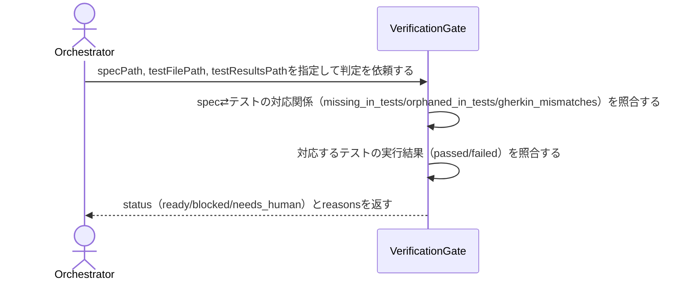

# 実装完了→検証フェーズへ進んでよいかを機械的に判定する：CheckVerificationGate

## 概要

- 対象usecase specのacceptanceScenariosと実装済みテストの対応関係、および渡されたテスト実行結果から、検証フェーズへ進んでよいか（ready/blocked/needs_human）を判定する。

---

## 存在意義

- spec-first+TDDというWaffle自身の開発プロセスでは、「テストを書いた」ことと「specの受け入れシナリオを実際に満たすテストを書いた」ことは同じではない。この区別を人間の目視確認に委ねると見落としが起き、フェーズを次に進めてよいかの判断が属人化する。
- 既存のcheck_scenario_drift（spec⇄テストの対応関係の検知）は差分を検出するだけで、「だから次に進んでよいか」という判断までは行わない。判断まで含めて機械化する経路が無いと、Orchestratorは毎回同じ判断ロジックを即興で組み立てることになり、判定基準がセッションごとにぶれる。

---

## 主アクターと意図

### 主アクター

Orchestrator（HarnessAgent）

### 意図

対象usecase specについて、実装完了フェーズから検証フェーズへ進んでよいかを判定したい

---

## 事前条件

- 対象usecase specのpathが要望テキストで与えられている
- 対象specに対応するネイティブテストファイルのpathが要望テキストで与えられている
- テスト実行結果を{passed: [...], failed: [...]}という形式（specのacceptanceScenariosのシナリオ名と同じ語彙のテスト名でpass/failを表す）で持つファイルのpathが要望テキストで与えられている

---

## 基本フロー



---

## 事後条件

- 判定結果がstatus（ready/blocked/needs_human）として返る
- statusの根拠がreasonsとして返る（人間が理由を確認できる）
- 本usecaseはテストを実行しない・specやテストファイルを書き換えない（読み取り専用・副作用なし）

---

## 受け入れ基準

- When specのacceptanceScenariosに対応するテストが1件以上未実装（missing_in_tests）のとき、システムはstatus blocked を返す shall。
- When 実装済みテストのうちspecに存在しないもの（orphaned_in_tests）、またはGherkinと内容が一致しないもの（gherkin_mismatches）が1件以上あるとき、システムはstatus needs_human を返す shall（意図的な追加か更新漏れかを機械的に判別できないため）。
- When spec⇄テストの対応関係に差分が無いが、対応するテストの実行結果に1件以上failedが含まれるとき、システムはstatus blocked を返す shall。
- When spec⇄テストの対応関係に差分が無く、対応する全テストがpassedであるとき、システムはstatus ready を返す shall。
- While 複数の条件に同時に該当するとき、システムはblocked/needs_human/readyの優先順位（missing_in_tests最優先、次にorphaned/mismatch、次にfailed、最後にready）で単一のstatusを決定する shall。
- When statusを返すとき、システムはその根拠をreasonsに含める shall。
- If specPathが存在しないとき、システムはINVALID_PATHエラーを返す shall。
- If testFilePathが存在しないとき、システムはINVALID_PATHエラーを返す shall。
- If testResultsPathが存在しない、またはJSONとして解釈できないとき、システムはINVALID_TEST_RESULTSエラーを返す shall。

---

## 操作保証

- While 同一の入力で複数回実行しても、システムは同じstatusを返す shall（副作用の無い読み取り専用操作）。
- When 判定を行うとき、システムはテスト自体を実行しない shall（既に生成済みのtestResultsPathを読むのみ。実行はOrchestrator側の責務）。

---

## エラー

| コード | 条件 |
|---|---|
| `INVALID_PATH` | - specPathまたはtestFilePathが存在しない |
| `INVALID_TEST_RESULTS` | - testResultsPathが存在しない、またはJSONとして解釈できない |

---

## 受け入れシナリオ

### 未実装のシナリオがあるときはblockedを返す

| 分類 | 観点 |
|---|---|
| 正常系 | 判定：missing_in_testsが1件以上あればblocked |

```gherkin
Scenario: 未実装のシナリオがあるときはblockedを返す
  Given specのacceptanceScenariosに対して未実装のシナリオを1件含む対象
  When CheckVerificationGateを実行する
  Then statusはblockedであり、reasonsに未実装のシナリオが含まれる
```

### 意図不明なズレがあるときはneeds_humanを返す

| 分類 | 観点 |
|---|---|
| 正常系 | 判定：orphaned_in_tests/gherkin_mismatchesが1件以上あればneeds_human |

```gherkin
Scenario: 意図不明なズレがあるときはneeds_humanを返す
  Given specに無いテスト（orphaned_in_tests）を1件含む対象
  When CheckVerificationGateを実行する
  Then statusはneeds_humanであり、reasonsにそのズレが含まれる
```

### 対応関係に差分は無いがテストが失敗しているときはblockedを返す

| 分類 | 観点 |
|---|---|
| 正常系 | 判定：spec⇄テストの対応は取れているがfailedが1件以上あればblocked |

```gherkin
Scenario: 対応関係に差分は無いがテストが失敗しているときはblockedを返す
  Given spec⇄テストの対応関係に差分が無く、1件failedを含むテスト実行結果
  When CheckVerificationGateを実行する
  Then statusはblockedであり、reasonsに失敗したテスト名が含まれる
```

### 対応関係に差分が無く全テストが成功しているときはreadyを返す

| 分類 | 観点 |
|---|---|
| 正常系 | 判定：差分無し・全passedならready |

```gherkin
Scenario: 対応関係に差分が無く全テストが成功しているときはreadyを返す
  Given spec⇄テストの対応関係に差分が無く、全てpassedのテスト実行結果
  When CheckVerificationGateを実行する
  Then statusはreadyである
```

### 複数条件に該当するときは優先順位に従い単一のstatusを返す

| 分類 | 観点 |
|---|---|
| 境界値 | 優先順位：missing_in_tests > orphaned/mismatch > failed > ready |

```gherkin
Scenario: 複数条件に該当するときは優先順位に従い単一のstatusを返す
  Given missing_in_testsとorphaned_in_testsを同時に含む対象
  When CheckVerificationGateを実行する
  Then statusはblockedである（missing_in_testsが最優先）
```

### 存在しないspecPathはエラーを返す

| 分類 | 観点 |
|---|---|
| 異常系 | エラー：specPathが存在しないときはINVALID_PATH |

```gherkin
Scenario: 存在しないspecPathはエラーを返す
  Given 実在しないspecPath
  When CheckVerificationGateを実行する
  Then INVALID_PATH エラーが返る
```

### 存在しないtestFilePathはエラーを返す

| 分類 | 観点 |
|---|---|
| 異常系 | エラー：testFilePathが存在しないときはINVALID_PATH |

```gherkin
Scenario: 存在しないtestFilePathはエラーを返す
  Given 実在しないtestFilePath
  When CheckVerificationGateを実行する
  Then INVALID_PATH エラーが返る
```

### 不正なtestResultsPathはエラーを返す

| 分類 | 観点 |
|---|---|
| 異常系 | エラー：testResultsPathが存在しない、またはJSONとして不正なときはINVALID_TEST_RESULTS |

```gherkin
Scenario: 不正なtestResultsPathはエラーを返す
  Given 存在しない、またはJSONとして不正なtestResultsPath
  When CheckVerificationGateを実行する
  Then INVALID_TEST_RESULTS エラーが返る
```

---

## 操作保証シナリオ

### 同一入力での再実行はべき等である

| 分類 | 観点 |
|---|---|
| 正常系 | べき等性：同一のspecPath/testFilePath/testResultsPathを2回実行しても結果が一致する |

```gherkin
Scenario: 同一入力での再実行はべき等である
  Given CheckVerificationGate システム と同一の入力
  When 2回連続で実行する
  Then 2回の結果は完全に一致する
```
