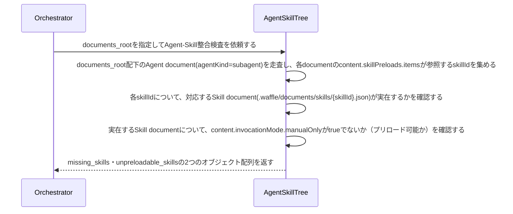

# uc-check-agent-skill-drift

---

## 概要

Agent(subagent)集約の実インスタンスがskillPreloadsで参照するSkillが、実在するか・Claude Codeの制約上プリロード可能か（disable-model-invocation:trueでないか）を機械的に検証する。Waffleのschema単体からは検出できないSubagent文書↔Skill文書間の参照整合性のドリフト。

---

## 名前

CheckAgentSkillDrift

---

## 主アクターと意図

- **主アクター**: Orchestrator（HarnessAgent）
- **意図**: Subagentがskillsとしてプリロード指定しているSkillが、実在しかつプリロード可能な状態であるかを確認したい

---

## 存在意義

AgentSchemaとSkillSchemaはそれぞれ独立に検証されるため、Subagentが参照するSkillの実在性やプリロード可否（Claude Code側の制約）は、どちらのschema単体からも検出できない盲点になっている。この検知が無ければ、実際にはロードできないSkillをプリロード指定したまま気づかれず、実行時に初めて（あるいは気づかれないまま）機能しない。

---

## 事前条件

- Document集約の実インスタンス群を走査する対象ディレクトリ（documents_root）が与えられている

---

## 基本フロー



---

## 事後条件

- 返り値は次の2フィールドを持つ: missing_skills（参照先Skill documentが実在しないAgent-skillIdの組）・unpreloadable_skills（参照先Skill documentは実在するが、content.invocationMode.manualOnlyがtrueであるためClaude Code上プリロードできないAgent-skillIdの組）
- agentKind=orchestratorのAgent documentは対象外とする（skillPreloadsを持たないため）
- content.skillPreloads自体を持たないsubagentは対象外とする
- Agent documentが1件も無い（agentサブディレクトリ自体が無い）場合もエラーにせず空配列を返す
- missing_skills・unpreloadable_skillsが共に空配列であれば、全subagentのskillPreloads参照が実在しかつプリロード可能である（正常系）

---

## 受け入れ基準

- When subagentのskillPreloads.itemsが参照するskillIdに対応するSkill documentが実在しないとき、システムはその組をmissing_skillsに含める shall。
- When 参照先Skill documentのcontent.invocationMode.manualOnlyがtrueであるとき、システムはその組をunpreloadable_skillsに含める shall（Claude Code公式仕様上、disable-model-invocation:trueのSkillはpreloadできないため）。
- While 全subagentのskillPreloads参照が実在しかつプリロード可能であるとき、システムはmissing_skills・unpreloadable_skills両方を空配列で返す shall。
- If 対象のdocuments_rootが存在しないとき、システムはINVALID_PATHエラーを返す shall。

---

## 操作保証

- When 対象のdocuments_rootが存在しないとき、システムは INVALID_PATH エラーを返す shall（対象を特定し取得する解決プロセス自体の契約であり、複数のusecaseに共通する）。

---

## エラー

| コード | 条件 |
|---|---|
| `INVALID_PATH` | documents_rootが存在しない、またはパストラバーサルを含む |

---

## 受け入れシナリオ

### agentディレクトリがまだ無いとき空配列を返す

| 分類 | 観点 |
|---|---|
| 正常系 | 境界値: Agent documentが1件も無い状態はエラーではなく空配列とする |

```gherkin
Scenario: agentディレクトリがまだ無いとき空配列を返す
  Given documents_rootは実在するがagentサブディレクトリがまだ無い（Agent documentが1件も無い）
  When Agent-Skill整合検査を実行する
  Then missing_skills・unpreloadable_skills両方が空配列で返る（エラーにしない）
```

### 全subagentの参照が実在しプリロード可能なとき差分なしと判定する

| 分類 | 観点 |
|---|---|
| 正常系 | 整合：全skillPreloads参照が実在しmanualOnlyでないSkillを指しているとき正常系（空配列） |

```gherkin
Scenario: 全subagentの参照が実在しプリロード可能なとき差分なしと判定する
  Given 全subagentのskillPreloads.itemsが、実在しmanualOnlyでないSkillを参照しているspecツリー
  When Agent-Skill整合検査を実行する
  Then missing_skills・unpreloadable_skills両方が空配列で返る
```

### 実在しないskillIdを参照するsubagentを検出する

| 分類 | 観点 |
|---|---|
| 異常系 | ドリフト：skillPreloads.itemsが実在しないSkillを参照している |

```gherkin
Scenario: 実在しないskillIdを参照するsubagentを検出する
  Given 実在しないskillIdをskillPreloads.itemsに持つsubagent
  When Agent-Skill整合検査を実行する
  Then missing_skillsにその組が含まれる
```

### manualOnlyのSkillをプリロード指定しているsubagentを検出する

| 分類 | 観点 |
|---|---|
| 異常系 | ドリフト：参照先SkillはinvocationMode.manualOnly=trueでありプリロード不可能 |

```gherkin
Scenario: manualOnlyのSkillをプリロード指定しているsubagentを検出する
  Given invocationMode.manualOnly=trueのSkillをskillPreloads.itemsに持つsubagent
  When Agent-Skill整合検査を実行する
  Then unpreloadable_skillsにその組が含まれる
```

---

## 操作保証シナリオ

### 存在しないdocuments_rootはINVALID_PATH

| 分類 | 観点 |
|---|---|
| 異常系 | エラー：走査起点の不在 |

```gherkin
Scenario: 存在しないdocuments_rootはINVALID_PATH
  When 存在しないdocuments_rootでAgent-Skill整合検査を実行する
  Then INVALID_PATHエラーが返る
```
