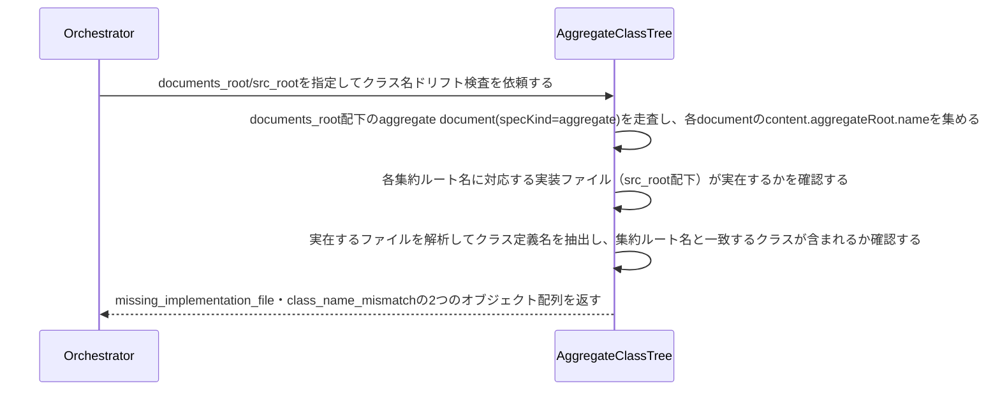

# 集約ルート名と実装クラス名の一致を検証する：CheckAggregateClassDrift

## 概要

- aggregate specが宣言する集約ルート名(aggregateRoot.name)と、対応する実装クラスが実際に持つクラス名が一致しているかを機械的に検証する。check-usecase-class-driftと同型の検知を集約にも適用し、集約の構造がJSON Schemaのみで表現されドリフトを検知できない盲点を埋める。

---

## 存在意義

- aggregate specのaggregateRoot.nameと実装クラス名が乖離したまま放置されると、specが実装から乖離した「違うモデル」を宣言し続けることになり、DDDのモデル駆動設計（モデルはコードに宿る）の前提が崩れる。usecaseについては既にcheck-usecase-class-driftがこの盲点を検出しているが、集約についてはこの検知が存在せず、agg-schema.jsonが宣言する集約ルート名に対応する実装クラスが実在するかを誰も確認していない。

---

## 主アクターと意図

### 主アクター

Orchestrator（HarnessAgent）

### 意図

aggregate specの集約ルート名と実装クラス名が一致しているかを確認したい

---

## 事前条件

- Document集約の実インスタンス群を走査する対象ディレクトリ（documents_root）が与えられている
- 集約Entityクラスの配置ルートディレクトリ（src_root）が与えられている
- 実装言語（language）が与えられている。省略時はpython

---

## 基本フロー



---

## 事後条件

- 返り値は次の5フィールドを持つ: missing_implementation_file（集約ルート名から導出したファイルパスが実在しないaggregateの組）・class_name_mismatch（実装ファイルは実在するが、集約ルート名と一致するクラス定義が含まれていないaggregateの組）・attribute_mismatch（クラスは実在するが、aggregate specのEntitiesが宣言する属性集合と、実装クラスが実際に持つフィールド集合が一致しないaggregateの組）・missing_value_object（aggregate specのValueObjectsが宣言する値オブジェクトのクラスが、同じ実装ファイル内に見つからない組）・value_object_attribute_mismatch（値オブジェクトのクラスは実在するが、ValueObjects宣言のattributesと実装クラスが実際に持つフィールド集合が一致しない組）
- ファイルパスの導出は、集約ルート名をsnake_caseに変換し、src_root配下に{name}.pyとして配置されている前提で行う
- クラス名・フィールド名の抽出は構文解析のみで行い、実行や意味理解はしない（宣言された名前と、実装ファイル内に存在するクラス定義名・フィールド宣言名の機械的な突き合わせのみ）
- 属性名の対応は、Entities宣言のcamelCase属性名(例: kindProfiles)をsnake_case(例: kind_profiles)に変換した上で、実装クラスのフィールド名集合と完全一致するかで判定する
- 値オブジェクトの対応は、ValueObjectsが宣言する名前(例: SchemaId)が、集約ルートと同じ実装ファイル内のクラス定義名として存在するかで判定する
- 値オブジェクトの属性対応は、ValueObjects宣言のitemがattributesを持つ場合のみ行う（attributesはDomainSpecSchemaで任意項目のため）。宣言されたattributesのcamelCase属性名をsnake_caseに変換した上で、その値オブジェクトの実装クラスが実際に持つフィールド集合と完全一致するかで判定する。attributesを宣言していない値オブジェクトは、クラスの実在確認（missing_value_object）のみで属性対応は対象外とする
- aggregate specがEntitiesの属性を1件も宣言していない場合は、attribute_mismatchの対象外とする（宣言が無い以上、比較しようがないため）
- missing_implementation_file・class_name_mismatch・attribute_mismatch・missing_value_object・value_object_attribute_mismatchの全てが空配列であれば、全aggregateの集約ルート名・実装クラス・属性集合・値オブジェクト・値オブジェクトの属性集合が一致している（正常系）

---

## 受け入れ基準

- When aggregate specの集約ルート名から導出したファイルパスが実在しないとき、システムはその組をmissing_implementation_fileに含める shall。
- When 実装ファイルは実在するが、集約ルート名と一致するクラス定義がそのファイル内に見つからないとき、システムはその組をclass_name_mismatchに含める shall。
- When クラス名は一致するが、Entitiesが宣言する属性集合(snake_case変換後)と実装クラスのフィールド集合が一致しないとき、システムはその組をattribute_mismatchに含める shall。
- When ValueObjectsが宣言する値オブジェクト名に対応するクラス定義が、同じ実装ファイル内に見つからないとき、システムはその組をmissing_value_objectに含める shall。
- When 値オブジェクトのクラス定義は見つかるが、ValueObjects宣言のattributes(宣言されている場合、snake_case変換後)と実装クラスのフィールド集合が一致しないとき、システムはその組をvalue_object_attribute_mismatchに含める shall。
- While 値オブジェクトのValueObjects宣言がattributesを持たないとき、システムはその値オブジェクトをvalue_object_attribute_mismatchの対象外とする shall。
- While 全aggregateの集約ルート名・実装クラス・属性集合・値オブジェクト・値オブジェクトの属性集合が一致しているとき、システムは5フィールド全てを空配列で返す shall。
- If 対象のdocuments_rootまたはsrc_rootが存在しないとき、システムはINVALID_PATHエラーを返す shall。
- If languageがサポート対象外のとき、システムはUNSUPPORTED_LANGUAGEエラーを返す shall。
- While languageが指定されないとき、システムはpythonとして扱う shall。

---

## 操作保証

- When 対象のdocuments_rootまたはsrc_rootが存在しないとき、システムは INVALID_PATH エラーを返す shall（対象を特定し取得する解決プロセス自体の契約であり、複数のusecaseに共通する）。

---

## エラー

| コード | 条件 |
|---|---|
| `INVALID_PATH` | documents_rootまたはsrc_rootが存在しない、またはパストラバーサルを含む |
| `UNSUPPORTED_LANGUAGE` | languageがサポート対象外（python/java/typescript/javascript以外） |

---

## 受け入れシナリオ

### 全aggregateの集約ルート名と実装クラスが一致するとき差分なしと判定する

| 分類 | 観点 |
|---|---|
| 正常系 | 整合：全集約ルート名・値オブジェクトが対応する実装ファイル内の同名クラスと一致し、属性集合も一致するとき正常系（空配列） |

```gherkin
Scenario: 全aggregateの集約ルート名と実装クラスが一致するとき差分なしと判定する
  Given 全aggregateの集約ルート名・属性集合・値オブジェクトが、対応する実装ファイル内の同名クラス・同一フィールド集合と一致するspecツリー
  When クラス名ドリフト検査を実行する
  Then missing_implementation_file・class_name_mismatch・attribute_mismatch・missing_value_object全てが空配列で返る
```

### 実装ファイルが存在しないaggregateを検出する

| 分類 | 観点 |
|---|---|
| 異常系 | ドリフト：集約ルート名から導出したファイルが実在しない |

```gherkin
Scenario: 実装ファイルが存在しないaggregateを検出する
  Given 集約ルート名から導出したファイルパスに対応する実装ファイルが実在しないaggregate document
  When クラス名ドリフト検査を実行する
  Then missing_implementation_fileにその組が含まれる
```

### クラス名が一致しないaggregateを検出する

| 分類 | 観点 |
|---|---|
| 異常系 | ドリフト：実装ファイルは実在するが集約ルート名と一致するクラスが無い |

```gherkin
Scenario: クラス名が一致しないaggregateを検出する
  Given 実装ファイルは実在するが、集約ルート名と一致するクラス定義を持たないaggregate document
  When クラス名ドリフト検査を実行する
  Then class_name_mismatchにその組が含まれる
```

### クラス名だけ一致し中身が空のaggregateを検出する

| 分類 | 観点 |
|---|---|
| 異常系 | ドリフト：クラス名の一致だけでは合格にせず、宣言された属性集合との一致まで確認する |

```gherkin
Scenario: クラス名だけ一致し中身が空のaggregateを検出する
  Given 集約ルート名と一致するクラスは存在するが、Entitiesが宣言する属性を1つも持たない実装
  When クラス名ドリフト検査を実行する
  Then attribute_mismatchにその組が含まれる
```

### 宣言された値オブジェクトが実装に存在しないaggregateを検出する

| 分類 | 観点 |
|---|---|
| 異常系 | ドリフト：ValueObjectsが宣言する値オブジェクトのクラスが実装ファイル内に無い |

```gherkin
Scenario: 宣言された値オブジェクトが実装に存在しないaggregateを検出する
  Given 集約ルートクラスは一致するが、ValueObjectsが宣言する値オブジェクトのクラス定義が実装ファイル内に無いaggregate document
  When クラス名ドリフト検査を実行する
  Then missing_value_objectにその組が含まれる
```

---

## 操作保証シナリオ

### 存在しないdocuments_rootはINVALID_PATH

| 分類 | 観点 |
|---|---|
| 異常系 | エラー：走査起点の不在 |

```gherkin
Scenario: 存在しないdocuments_rootはINVALID_PATH
  When 存在しないdocuments_rootでクラス名ドリフト検査を実行する
  Then INVALID_PATHエラーが返る
```
