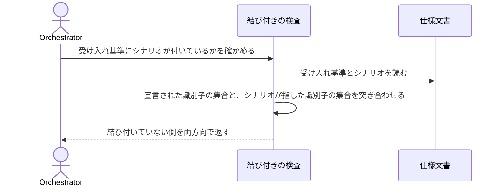

# 受け入れ基準にシナリオが付いているかを確かめる：uc-check-criteria-coverage

## 概要

- 仕様文書の中で、受け入れ基準と、それを満たすと宣言されたシナリオを突き合わせ、結び付いていない側を両方向で報告する。
- 報告するのは結び付きの有無だけで、シナリオが実際にその基準を確かめているかは判定しない。

---

## 存在意義

- 受け入れ基準とシナリオは対で担保を成す。対応が宣言されていないと、ある条件がどのシナリオからも覆われていないことを機械が言えず、件数の差までしか分からない。どの基準が欠けているかは人が読んで数えるしかなかった。
- シナリオが実装へ転写されて照合されることは既に担保されているが、その手前——基準とシナリオが結び付いているか——には突き合わせが無い。末端が実装に届いていても、そもそも誰も担当していない条件は素通りする。

---

## 主アクターと意図

### 主アクター

Orchestrator（HarnessAgent）

### 意図

受け入れ基準のうち、どのシナリオからも指されていないものを知りたい

---

## 事前条件

- 対象の仕様文書が、受け入れ基準に識別子を持つ形で書かれていること

---

## 入力

| 入力 | 説明 |
|---|---|
| `path` | 確かめる対象の仕様文書。1件だけを見るときに指定する |
| `documentsRoot` | 仕様側の走査範囲。配下の仕様文書をまとめて確かめるときに指定する |

---

## 基本フロー



---

## 事後条件

- 返り値は unreferenced（どのシナリオからも指されていない受け入れ基準）を持つ
- 返り値は dangling（実在しない識別子を指しているシナリオと、その識別子）を持つ
- 返り値は duplicate_ids（同一文書内で重複している識別子）を持つ
- 返り値は unlinked_scenarios（満たす条件を1件も挙げていないシナリオ）を持つ
- 返り値は uncovered_by_omission（満たす基準の欄そのものが未記入のシナリオ）を持つ。未記入を黙って対象から外すと、宣言の欠落と検査に通ったことが同じ見た目になる
- 結び付きの有無だけを判定し、シナリオが指した条件を実際に確かめているかは判定しない

---

## 受け入れ基準

| 符号 | 基準 |
|---|---|
| reports-unreferenced | When ある受け入れ基準がどのシナリオからも指されていないとき、システムはその基準を unreferenced に含める shall。 |
| reports-dangling | When シナリオが同一文書内に実在しない識別子を指しているとき、システムはその組を dangling に含める shall。 |
| reports-duplicate-ids | When 同一文書内で受け入れ基準の識別子が重複しているとき、システムはその識別子を duplicate_ids に含める shall。 |
| reports-unlinked-scenarios | When シナリオが満たす条件を1件も挙げていないとき、システムはそのシナリオを unlinked_scenarios に含める shall。 |
| reports-omission | When シナリオが満たす基準の欄そのものを持たないとき、システムはそのシナリオを uncovered_by_omission に含める shall。 |
| empty-when-complete | While すべての受け入れ基準がいずれかのシナリオから指されているとき、システムは unreferenced を空配列で返す shall。 |
| scans-root | While 走査範囲が指定されたとき、システムは配下のすべての仕様文書を対象にする shall。 |

---

## 操作保証

- {'id': 'invalid-path', 'text': 'When 対象のパスが存在しないとき、システムは INVALID_PATH エラーを返す shall（対象を特定し取得する解決プロセス自体の契約であり、複数のusecaseに共通する）。'}

---

## エラー

| コード | 条件 |
|---|---|
| `INVALID_PATH` | - 対象のパスが存在しない、またはパストラバーサルを含む |

---

## 受け入れシナリオ

### どのシナリオからも指されていない条件を挙げる

| 分類 | 観点 | 満たす基準 |
|---|---|---|
| 異常系 | 宣言の突き合わせ：条件側から見た欠けを検出できるか | reports-unreferenced |

```gherkin
Scenario: どのシナリオからも指されていない条件を挙げる
  Given 受け入れ基準を3件持ち、そのうち2件だけを指すシナリオを持つ仕様文書
  When 受け入れ基準にシナリオが付いているかを確かめる
  Then 指されていない1件が unreferenced に現れる
```

### 実在しない識別子を指しているシナリオを挙げる

| 分類 | 観点 | 満たす基準 |
|---|---|---|
| 異常系 | 参照の健全性：指す先が在るかを確かめられるか | reports-dangling |

```gherkin
Scenario: 実在しない識別子を指しているシナリオを挙げる
  Given 同一文書内に無い識別子を指すシナリオを持つ仕様文書
  When 受け入れ基準にシナリオが付いているかを確かめる
  Then そのシナリオと識別子の組が dangling に現れる
```

### 重複した識別子を挙げる

| 分類 | 観点 | 満たす基準 |
|---|---|---|
| 異常系 | 参照の健全性：指す先が一意に定まるか | reports-duplicate-ids |

```gherkin
Scenario: 重複した識別子を挙げる
  Given 同じ識別子を持つ受け入れ基準を2件持つ仕様文書
  When 受け入れ基準にシナリオが付いているかを確かめる
  Then その識別子が duplicate_ids に現れる
```

### どの基準も挙げていないシナリオを挙げる

| 分類 | 観点 | 満たす基準 |
|---|---|---|
| 異常系 | 宣言の突き合わせ：シナリオ側から見た欠けを検出できるか | reports-unlinked-scenarios |

```gherkin
Scenario: どの基準も挙げていないシナリオを挙げる
  Given 満たす条件を空で宣言したシナリオを持つ仕様文書
  When 受け入れ基準にシナリオが付いているかを確かめる
  Then そのシナリオが unlinked_scenarios に現れる
```

### 満たす基準の欄を持たないシナリオを挙げる

| 分類 | 観点 | 満たす基準 |
|---|---|---|
| 境界値 | 欠落と合格の区別：未記入を黙って対象外にしないか | reports-omission |

```gherkin
Scenario: 満たす基準の欄を持たないシナリオを挙げる
  Given 満たす基準の欄そのものを持たないシナリオを持つ仕様文書
  When 受け入れ基準にシナリオが付いているかを確かめる
  Then そのシナリオが uncovered_by_omission に現れる
  And unreferenced には現れない
```

### すべて指されているときは欠けなしと判定する

| 分類 | 観点 | 満たす基準 |
|---|---|---|
| 正常系 | 宣言の突き合わせ：整合しているときに空で返るか | empty-when-complete |

```gherkin
Scenario: すべて指されているときは欠けなしと判定する
  Given すべての受け入れ基準がいずれかのシナリオから指されている仕様文書
  When 受け入れ基準にシナリオが付いているかを確かめる
  Then unreferenced が空で返る
  And dangling が空で返る
```

### 走査範囲を指定すると配下をまとめて確かめる

| 分類 | 観点 | 満たす基準 |
|---|---|---|
| 正常系 | 走査の範囲：複数の仕様文書を一度に対象にできるか | scans-root |

```gherkin
Scenario: 走査範囲を指定すると配下をまとめて確かめる
  Given 指されていない条件を持つ仕様文書が2件ある走査範囲
  When その走査範囲で受け入れ基準にシナリオが付いているかを確かめる
  Then 2件とも unreferenced に現れる
```

---

## 操作保証シナリオ

### 存在しないパスは受け付けない

| 分類 | 観点 | 満たす基準 |
|---|---|---|
| 異常系 | 解決プロセスの契約：対象を取得できないときの扱い | invalid-path |

```gherkin
Scenario: 存在しないパスは受け付けない
  Given 存在しないパス
  When 受け入れ基準にシナリオが付いているかを確かめる
  Then INVALID_PATH エラーが返る
```
