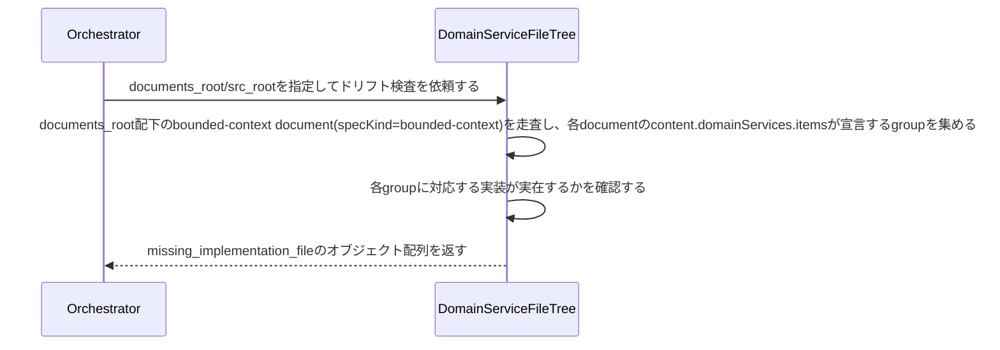

# 業務サービス名と実装ファイルの対応を検証する：CheckDomainServiceDrift

## 概要

- bounded-context specが宣言する業務サービスのgroup（実装ファイル単位）が、実際に対応するファイルとして実在するかを機械的に検証する。1業務サービス＝1ファイルという規約を強制せず、複数サービスが同じgroupを共有し同じファイルに同居することを許容した上で、宣言と実装の対応関係のドリフトを検出する。

---

## 存在意義

- 業務サービスは値オブジェクト・集約と異なり、宣言された名前から実装ファイルパスを機械的に導出できない（1サービス1ファイルという規約が無く、関連する複数サービスが同じファイルに同居することがある）。宣言（bounded-context spec）と実装（domain/services配下のファイル）が乖離しても、他のusecase/aggregateクラスドリフト検知と違い、これを検知する仕組みが無かった。TDDが担保するのは振る舞いの正しさであり、宣言と実装の対応関係という別の関心事は別途機械的に検証する必要がある。

---

## 主アクターと意図

### 主アクター

Orchestrator（HarnessAgent）

### 意図

業務サービスのgroupが実際の実装ファイルと対応しているかを確認したい

---

## 事前条件

- Document集約の実インスタンス群を走査する対象ディレクトリ（documents_root）が与えられている
- 業務サービス実装ファイルの配置ルートディレクトリ（src_root）が与えられている

---

## 入力

| 入力 | 説明 |
|---|---|
| `documentsRoot` | 仕様側の走査範囲。未指定なら architectureRef が受け持つコンテキストから決まる |
| `srcRoot` | 業務サービス実装ファイルの配置ルートディレクトリ（明示指定時は--architectureRefより優先） |
| `architectureRef` | srcRoot未指定時に参照するarchitecture documentのdocumentId（例: architecture-waffle） |

---

## 基本フロー


```mermaid
sequenceDiagram
    Orchestrator->>DomainServiceFileTree: documents_root/src_rootを指定してドリフト検査を依頼する
    DomainServiceFileTree->>DomainServiceFileTree: documents_root配下のbounded-context document(specKind=bounded-context)を走査し、各documentのcontent.domainServices.itemsが宣言するgroupを集める
    DomainServiceFileTree->>DomainServiceFileTree: 各groupに対応する実装が実在するかを確認する
    DomainServiceFileTree-->>Orchestrator: missing_implementation_fileのオブジェクト配列を返す
```

---

## 事後条件

- 返り値はmissing_implementation_file（groupから導出したファイルパスが実在しない業務サービスの組）フィールドを持つ
- 同じgroupを持つ複数の業務サービスは、1回のファイル存在確認にまとめられる（同じファイルを重複してチェックしない）
- ファイルの実在確認のみを行い、ファイル内の具体的な関数・クラス定義までは検証しない（内容の正しさはTDDが別途担保する）
- missing_implementation_fileが空配列であれば、全業務サービスのgroupと実装ファイルが一致している（正常系）
- 返り値は orphaned_implementation_file を持つ。規約が業務サービスの配置として宣言した場所に在りながら、どの仕様からも名指しされていない実装ファイルの一覧である。仕様が実装を説明できているかは、宣言した分を数えるだけでは分からない——宣言しなければ何を実装しても綺麗に見えるため。

---

## 受け入れ基準

| 基準 |
|---|
| When 業務サービスのgroupから導出したファイルパスが実在しないとき、システムはその組をmissing_implementation_fileに含める shall。 |
| While 全業務サービスのgroupと実装ファイルが一致しているとき、システムはmissing_implementation_fileを空配列で返す shall。 |
| While 複数の業務サービスが同じgroupを共有しているとき、システムは対応するファイルの存在確認を1回にまとめる shall（重複報告しない）。 |
| If 対象のdocuments_rootまたはsrc_rootが存在しないとき、システムはINVALID_PATHエラーを返す shall。 |
| When 規約が業務サービスの配置として宣言した場所に、どの仕様からも名指しされていない実装ファイルが在るとき、システムはそのファイルをorphaned_implementation_file に含める shall。 |
| When 対象のdocuments_rootまたはsrc_rootが存在しないとき、システムは INVALID_PATH エラーを返す shall（対象を特定し取得する解決プロセス自体の契約であり、複数のusecaseに共通する）。 |

---

## エラー

| コード | 条件 |
|---|---|
| `INVALID_PATH` | - documents_rootまたはsrc_rootが存在しない、またはパストラバーサルを含む |

---

## 受け入れシナリオ

### 全業務サービスのgroupと実装ファイルが一致するとき差分なしと判定する

| 分類 | 観点 |
|---|---|
| 正常系 | 整合：全groupが対応する実装ファイルと一致するとき正常系（空配列） |

```gherkin
Scenario: 全業務サービスのgroupと実装ファイルが一致するとき差分なしと判定する
  Given 全業務サービスのgroupが、対応する実装ファイルと一致するspecツリー
  When ドリフト検査を実行する
  Then missing_implementation_fileが空配列で返る
```

### 実装ファイルが存在しない業務サービスを検出する

| 分類 | 観点 |
|---|---|
| 異常系 | ドリフト：groupから導出したファイルが実在しない |

```gherkin
Scenario: 実装ファイルが存在しない業務サービスを検出する
  Given groupから導出したファイルパスに対応する実装ファイルが実在しない業務サービス宣言
  When ドリフト検査を実行する
  Then missing_implementation_fileにその組が含まれる
```

### 同じgroupを共有する複数サービスは1回のファイル確認にまとめられる

| 分類 | 観点 |
|---|---|
| 境界値 | 重複排除：同一groupの複数サービスをそれぞれ個別に報告しない |

```gherkin
Scenario: 同じgroupを共有する複数サービスは1回のファイル確認にまとめられる
  Given 同じgroupを宣言する2件以上の業務サービス（対応する実装ファイルは実在しない）
  When ドリフト検査を実行する
  Then missing_implementation_fileには重複を除いた1件だけが含まれる
```

### 宣言に無い実装ファイルを孤立として検出する

| 分類 | 観点 |
|---|---|
| 異常系 | ドリフト: 逆走。仕様に無い業務サービスが実装側の都合で増えている |

```gherkin
Scenario: 宣言に無い実装ファイルを孤立として検出する
  Given 規約が業務サービスの配置として宣言した場所
  And その場所に在るが、どの仕様も名指ししていない実装ファイル
  When ドリフト検査を実行する
  Then orphaned_implementation_file にそのファイルが含まれる
```

### 対象のdocuments_rootまたはsrc_rootが存在しないときのときINVALID_PATH

| 分類 | 観点 |
|---|---|
| 異常系 | エラー：対象のdocuments_rootまたはsrc_rootが存在しないとき |

```gherkin
Scenario: 対象のdocuments_rootまたはsrc_rootが存在しないときのときINVALID_PATH
  Given 対象のdocuments_rootまたはsrc_rootが存在しないとき状況
  When 本ユースケースを実行する
  Then INVALID_PATH エラーが返る
```
