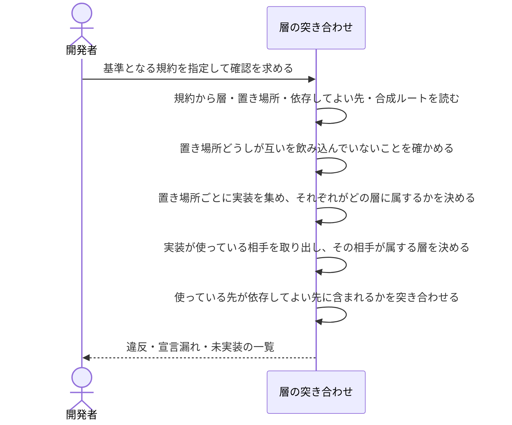

# 層の宣言と実装の依存を突き合わせる：uc-check-layer-drift

## 概要

- 規約が宣言する層と依存してよい先を、実装が実際に使っている相手と突き合わせ、宣言が許していない依存を洗い出す。
- あわせて、どの層にも属さない実装と、宣言されていながらまだ実装の無い層を報告する。宣言と実装のどちらが遅れているかを、同じ確認の中で示す。

---

## 存在意義

- 層と依存の向きは規約に宣言されているが、それを実装と突き合わせる手段が無い。宣言は誰にも読まれないまま置かれ、誤っていても正しくても同じように見える。
- 宣言が読まれないと、規約を直す作業に手応えが無くなる。直した宣言が実装に効いたことを確かめられないため、宣言はやがて実態から離れ、書いてあるだけの文章になる。
- 依存の向きは、崩れても個々の変更としては小さく見える。積み上がってから気づくと、戻す費用が層を導入した利益を上回る。

---

## 主アクターと意図

### 主アクター

開発者

### 意図

規約に書いた層と依存の向きが、実装でも実際に守られているかを確かめたい

---

## 事前条件

- 確認の基準となる規約が、層とその置き場所、依存してよい先を宣言している

---

## 基本フロー



---

## 事後条件

- 宣言が許していない依存が、実装と相手の層とともに列挙されている
- どの層にも属さない実装が列挙されている
- 宣言された置き場所のうち、まだ実装が存在しないものが列挙されている
- 実装は変更されていない（確認だけを行う）

---

## 受け入れ基準

- When 基準となる規約が指定されたとき、層の突き合わせは その規約が宣言する層・置き場所・依存してよい先だけを基準として使う shall
- When 実装が、依存してよい先に含まれない層を使っているとき、層の突き合わせは その実装と相手の層を違反として報告する shall
- When 実装が、自分と同じ層だけを使っているとき、層の突き合わせは 違反を報告しない shall
- When 実装が、規約の受け持つ範囲の外にある部品を使っているとき、層の突き合わせは 違反を報告しない shall
- When 実装が合成ルートとして宣言された場所にあるとき、層の突き合わせは その実装を依存の規則から除外する shall
- When 実装がどの層の置き場所にも入らないとき、層の突き合わせは その実装を宣言漏れとして報告する shall
- When 宣言された置き場所が存在しないとき、層の突き合わせは その層を未実装として報告し、他の層の確認を続ける shall
- If ある層の置き場所が別の層の置き場所を含んでいるならば、層の突き合わせは 実装を確かめる前に宣言の誤りとして報告する shall
- If 基準となる規約が指定されていない、または見つからないならば、層の突き合わせは 確認を行わず拒否する shall
- When ファイルが何も宣言していない（中身が無い）とき、層の突き合わせは そのファイルを層の割り当ての対象にしない shall

---

## 操作保証

- When 指定された規約が見つからないとき、システムは ARCHITECTURE_REF_NOT_FOUND エラーを返す shall（規約を特定し取得する解決プロセス自体の契約であり、複数のusecaseに共通する）。
- When 指定された規約が層の置き場所を決めるのに足りる宣言を持たないとき、システムは ARCHITECTURE_REF_UNRESOLVED エラーを返す shall（同上）。

---

## エラー

| コード | 条件 |
|---|---|
| `MISSING_PARAM` | - 確認の基準となる規約が指定されていない |
| `ARCHITECTURE_REF_NOT_FOUND` | - 指定された規約が見つからない |
| `ARCHITECTURE_REF_UNRESOLVED` | - 指定された規約が、層の置き場所を決めるのに足りる宣言を持たない |
| `OVERLAPPING_LAYER_PATHS` | - ある層の置き場所が、別の層の置き場所を含んでいる<br>- 実装がどちらの層に属するか、置き場所から決められない |

---

## 受け入れシナリオ

### 宣言に沿った依存だけなら差分は出ない

| 分類 | 観点 |
|---|---|
| 正常系 | 整合：宣言と実装が一致しているとき、何も報告しない |

```gherkin
Scenario: 宣言に沿った依存だけなら差分は出ない
  Given 層と依存してよい先を宣言した規約
  And その宣言に沿った依存だけを持つ実装
  When 層の差分を確かめる
  Then 違反は報告されない
```

### 依存してよい先に無い層へ依存していると違反として報告する

| 分類 | 観点 |
|---|---|
| 異常系 | 依存方向：宣言が許していない向きの依存を検出する |

```gherkin
Scenario: 依存してよい先に無い層へ依存していると違反として報告する
  Given 層と依存してよい先を宣言した規約
  And 依存してよい先に無い層を使っている実装
  When 層の差分を確かめる
  Then その実装と、使っている層が違反として報告される
```

### 同じ層の中での依存は違反にしない

| 分類 | 観点 |
|---|---|
| 境界値 | 依存方向：自分自身の層は依存してよい先の宣言を要さない |

```gherkin
Scenario: 同じ層の中での依存は違反にしない
  Given 依存してよい先を1つも持たない層
  And その層の中だけで完結している依存
  When 層の差分を確かめる
  Then 違反は報告されない
```

### 宣言の外にある部品への依存は対象にしない

| 分類 | 観点 |
|---|---|
| 正常系 | 走査範囲：規約が受け持つ範囲の外にあるものを違反にしない |

```gherkin
Scenario: 宣言の外にある部品への依存は対象にしない
  Given 層の置き場所を宣言した規約
  And その置き場所の外にある部品を使っている実装
  When 層の差分を確かめる
  Then 違反は報告されない
```

### 合成ルートは依存の規則から除外する

| 分類 | 観点 |
|---|---|
| 正常系 | 例外の扱い：層のグラフの外にある場所を規則で縛らない |

```gherkin
Scenario: 合成ルートは依存の規則から除外する
  Given 合成ルートの場所を宣言した規約
  And すべての層を使っている合成ルート
  When 層の差分を確かめる
  Then 違反は報告されない
```

### どの層にも属さない実装は宣言漏れとして報告する

| 分類 | 観点 |
|---|---|
| 異常系 | 被覆：宣言されていない置き場所に実装が置かれていることを見逃さない |

```gherkin
Scenario: どの層にも属さない実装は宣言漏れとして報告する
  Given 層の置き場所を宣言した規約
  And どの層の置き場所にも入らない場所に置かれた実装
  When 層の差分を確かめる
  Then その実装が宣言漏れとして報告される
```

### 宣言した置き場所が無ければ未実装として報告する

| 分類 | 観点 |
|---|---|
| 異常系 | 被覆：規約を先に書いて実装を後から合わせる進め方を、失敗にしない |

```gherkin
Scenario: 宣言した置き場所が無ければ未実装として報告する
  Given まだ実装が存在しない層を含む規約
  When 層の差分を確かめる
  Then その層が未実装として報告され、他の層の確認は続く
```

### ある層の置き場所が別の層を飲み込んでいると宣言の誤りとして報告する

| 分類 | 観点 |
|---|---|
| 異常系 | 宣言の健全性：実装を層へ割り当てられない宣言そのものを検出する |

```gherkin
Scenario: ある層の置き場所が別の層を飲み込んでいると宣言の誤りとして報告する
  Given ある層の置き場所が、別の層の置き場所を含んでいる規約
  When 層の差分を確かめる
  Then 実装を確かめる前に、宣言の誤りとして報告される
```

### 規約を指定しないと拒否される

| 分類 | 観点 |
|---|---|
| 異常系 | 事前条件：何を基準に確かめるかが決まらない呼び出しを受け付けない |

```gherkin
Scenario: 規約を指定しないと拒否される
  Given 規約の指定が無い
  When 層の差分を確かめる
  Then 拒否される
```

### 中身の無いファイルは宣言漏れに数えない

| 分類 | 観点 |
|---|---|
| 境界値 | 被覆：何も宣言していないファイルを所見に混ぜ、警報の意味を薄めない |

```gherkin
Scenario: 中身の無いファイルは宣言漏れに数えない
  Given 層の置き場所を宣言した規約
  And どの層にも属さない場所にある、中身の無いファイル
  When 層の差分を確かめる
  Then 宣言漏れとして報告されない
```

---

## 操作保証シナリオ

### 見つからない規約はARCHITECTURE_REF_NOT_FOUND

| 分類 | 観点 |
|---|---|
| 異常系 | エラー：規約の不在 |

```gherkin
Scenario: 見つからない規約はARCHITECTURE_REF_NOT_FOUND
  When 存在しない規約を指定して層の差分を確かめる
  Then ARCHITECTURE_REF_NOT_FOUNDエラーが返る
```

### 置き場所を決められない規約はARCHITECTURE_REF_UNRESOLVED

| 分類 | 観点 |
|---|---|
| 異常系 | エラー：規約が置き場所の宣言を欠く |

```gherkin
Scenario: 置き場所を決められない規約はARCHITECTURE_REF_UNRESOLVED
  When 層の置き場所を決めるのに足りる宣言を持たない規約を指定して層の差分を確かめる
  Then ARCHITECTURE_REF_UNRESOLVEDエラーが返る
```
