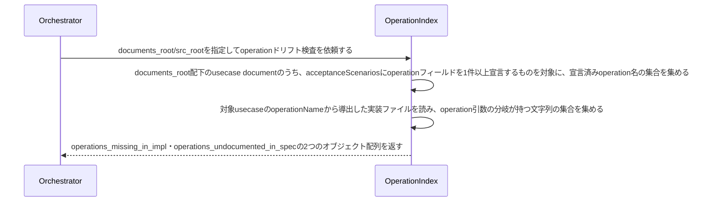

# operation名と実装のoperation分岐の一致を検証する：CheckOperationDrift

## 概要

- usecase specのacceptanceScenariosが宣言するoperation名と、対応する実装が実際に持つoperation分岐の文字列が一致しているかを機械的に検証する。複数の操作をoperation引数で分岐するusecase（QueryDocument等）の操作名が、specの自由記述にしか現れず実装から乖離しても誰も気づけない、という盲点を検出する。

---

## 存在意義

- operation名は複数の操作を持つusecaseの公開契約そのものであり、呼び出し側はこの文字列を知らなければ操作を実行できない
- この検知が無ければ、実装でoperationの文字列をリネームしても、spec側の自由記述（Gherkin等）は誰にも壊されずに古いまま残り続け、仕様が実装から静かに乖離する

---

## 主アクターと意図

### 主アクター

Orchestrator（HarnessAgent）

### 意図

usecase specが宣言するoperation名と実装のoperation分岐が一致しているかを確認したい

---

## 事前条件

- Document集約の実インスタンス群を走査する対象ディレクトリ（documents_root）が与えられている
- usecase実装クラスの配置ルートディレクトリ（src_root）が与えられている

---

## 基本フロー



---

## 事後条件

- 返り値は次の2フィールドを持つ: operations_missing_in_impl（specが宣言するが実装のoperation分岐には存在しない操作の組）・operations_undocumented_in_spec（実装のoperation分岐にはあるがspecのどのシナリオにも宣言されていない操作の組）
- acceptanceScenariosにoperationフィールドを1件も宣言していないusecase（単一操作のusecase等）は対象外とする
- operations_missing_in_impl・operations_undocumented_in_specの両方が空配列であれば、宣言と実装のoperationが完全に一致している（正常系）

---

## 受け入れ基準

- When usecase specが宣言するoperation名が実装のoperation分岐に存在しないとき、システムはその組をoperations_missing_in_implに含める shall。
- When 実装のoperation分岐にはあるがusecase specのどのシナリオにも宣言されていない操作があるとき、システムはその組をoperations_undocumented_in_specに含める shall。
- While acceptanceScenariosにoperationフィールドを1件も宣言していないusecaseであるとき、システムはそのusecaseを突き合わせの対象にしない shall。
- While 宣言と実装のoperationが完全に一致しているとき、システムはoperations_missing_in_impl・operations_undocumented_in_spec両方を空配列で返す shall。
- If 対象のdocuments_rootまたはsrc_rootが存在しないとき、システムはINVALID_PATHエラーを返す shall。

---

## 操作保証

- When 対象のdocuments_rootまたはsrc_rootが存在しないとき、システムは INVALID_PATH エラーを返す shall（対象を特定し取得する解決プロセス自体の契約であり、複数のusecaseに共通する）。

---

## エラー

| コード | 条件 |
|---|---|
| `INVALID_PATH` | documents_rootまたはsrc_rootが存在しない、またはパストラバーサルを含む |

---

## 受け入れシナリオ

### 宣言と実装のoperationが完全一致するとき差分なしと判定する

| 分類 | 観点 |
|---|---|
| 正常系 | 整合：specが宣言するoperation名の集合と実装のoperation分岐の集合が完全一致するとき正常系（空配列） |

```gherkin
Scenario: 宣言と実装のoperationが完全一致するとき差分なしと判定する
  Given specが宣言するoperation名の集合と、実装のoperation分岐の集合が完全一致するusecase
  When operationドリフト検査を実行する
  Then operations_missing_in_impl・operations_undocumented_in_spec両方が空配列で返る
```

### specが宣言するが実装に無いoperationを検出する

| 分類 | 観点 |
|---|---|
| 異常系 | ドリフト：specが宣言するが実装のoperation分岐には存在しない |

```gherkin
Scenario: specが宣言するが実装に無いoperationを検出する
  Given specが宣言するが実装のoperation分岐には存在しないoperation名
  When operationドリフト検査を実行する
  Then operations_missing_in_implにその組が含まれる
```

### 実装にあるがspecに未宣言のoperationを検出する

| 分類 | 観点 |
|---|---|
| 異常系 | ドリフト：実装のoperation分岐にはあるがspecのどのシナリオにも宣言されていない |

```gherkin
Scenario: 実装にあるがspecに未宣言のoperationを検出する
  Given 実装のoperation分岐にはあるがspecのどのシナリオにも宣言されていないoperation
  When operationドリフト検査を実行する
  Then operations_undocumented_in_specにその組が含まれる
```

### operationを1件も宣言していないusecaseは対象外

| 分類 | 観点 |
|---|---|
| 境界値 | 対象外：単一操作のusecase等、operationフィールドを1件も宣言していないusecaseは突き合わせない |

```gherkin
Scenario: operationを1件も宣言していないusecaseは対象外
  Given acceptanceScenariosのどのシナリオにもoperationフィールドを宣言していないusecase
  When operationドリフト検査を実行する
  Then そのusecaseは突き合わせの対象にならず、差分にも現れない
```

---

## 操作保証シナリオ

### 存在しないdocuments_rootはINVALID_PATH

| 分類 | 観点 |
|---|---|
| 異常系 | エラー：走査起点の不在 |

```gherkin
Scenario: 存在しないdocuments_rootはINVALID_PATH
  When 存在しないdocuments_rootでoperationドリフト検査を実行する
  Then INVALID_PATHエラーが返る
```
