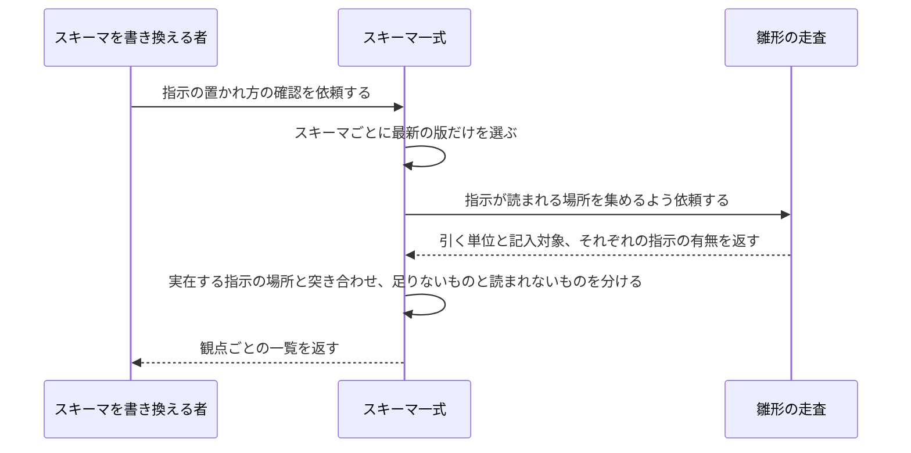

# スキーマの指示の置かれ方を確かめる：uc-check-prompt-contract

## 概要

- スキーマが定める2つの指示——引いた人向けの x-prompt-query と、値を書き込むときに読む x-prompt-write——が、然るべき場所に然るべき名前で置かれているかを確かめる操作。
- 指示の中身が良いかどうかは判定しない。置かれ方だけを見る。

---

## 存在意義

- 指示が抜けたまま気づかないと、その欄を埋める者はガイダンス無しで値を決めることになり、書き手ごとに違うものが入る。実際に12ブロックで抜けていた。
- 指示は、読まれない場所へ置いても書いた本人には気づけない。ブロック直下に書き込み用の指示を置く、契約に無いキーを足す——どちらも見た目には揃っているのに、誰にも届かない。実際にこの3つとも起きた。
- 置かれ方は人が数えると間違える。同じ測定を3回試み、3回とも誤った。原因は毎回同じで、どこに置かれるべきかを知っている既存の走査を借りずに、その場で数え方を作り直したこと。人に守らせる規約ではなく、機械が持つべき判定である。

---

## 主アクターと意図

### 主アクター

スキーマを書き換える者

### 意図

自分が足した指示が、実際に読まれる場所に置かれているかを確かめたい

---

## 事前条件

- 対象となるスキーマが1つ以上ある

---

## 入力

| 入力 | 説明 |
|---|---|
| `schemaRef` | 確かめる対象のschemaRef（例: DomainSpecSchema/v8） |

---

## 基本フロー



---

## 事後条件

- 読み方の指示が無いブロックの一覧が返っている
- 書き方の指示が無い記入対象の一覧が返っている
- 契約に無い名前の指示の一覧が返っている
- スキーマそのものは変わっていない

---

## 受け入れ基準

- When 確認を求めたとき、システムは blockType を持つ定義のうち読み方の指示が無いものを返す shall。
- When 確認を求めたとき、システムは値を書き込む欄のうち書き方の指示が無いものを返す shall。
- When 確認を求めたとき、システムは x-prompt-query と x-prompt-write 以外のx-prompt- で始まるキーを返す shall（契約が認める名前はこの2つだけ）。
- When 記入対象がどこかを決めるとき、システムは雛形を組み立てる既存の走査をそのまま使う shall（数え方をこの操作の側で作り直さない）。
- While 確認を行う間、システムは指示の中身が指示として適切かを判定しない shall。

---

## 操作保証

- When 同じ確認を複数回実行したとき、システムの生成する結果は常にべき等である shall。
- While 確認を行う間、システムはスキーマを一切書き換えない shall。

---

## エラー

| コード | 条件 |
|---|---|
| `SCHEMA_NOT_FOUND` | - 対象のスキーマが1つも見つからない |

---

## 受け入れシナリオ

### 読み方の指示が無いブロックを見つける

| 分類 | 観点 |
|---|---|
| 異常系 | 被覆：引く単位に指示があるか |

```gherkin
Scenario: 読み方の指示が無いブロックを見つける
  Given 読み方の指示を持たないブロックがあるスキーマ
  When 確認を求める
  Then そのブロックが、読み方の指示が無いものとして返る
```

### 書き方の指示が無い記入対象を見つける

| 分類 | 観点 |
|---|---|
| 異常系 | 被覆：値を書き込む欄に指示があるか |

```gherkin
Scenario: 書き方の指示が無い記入対象を見つける
  Given 書き方の指示を持たない記入対象があるスキーマ
  When 確認を求める
  Then その記入対象が、書き方の指示が無いものとして返る
```

### 契約に無い名前の指示を見つける

| 分類 | 観点 |
|---|---|
| 異常系 | 契約：使ってよい名前は2つだけ |

```gherkin
Scenario: 契約に無い名前の指示を見つける
  Given x-prompt-query でも x-prompt-write でもない x-prompt- で始まるキーを持つスキーマ
  When 確認を求める
  Then そのキーが、契約に無い名前として返る
```

### 入れ子の奥にある記入対象も見落とさない

| 分類 | 観点 |
|---|---|
| 境界値 | 反例：ブロック直下だけを見ると、奥にある指示を数え落とす |

```gherkin
Scenario: 入れ子の奥にある記入対象も見落とさない
  Given 配列の要素の中に、さらに記入対象を持つスキーマ
  And その記入対象には書き方の指示がある
  When 確認を求める
  Then その記入対象は、指示が無いものとして返らない
```

### 種別ごとに書き分けられた指示を欠落と数えない

| 分類 | 観点 |
|---|---|
| 境界値 | 反例：指示は1つの文字列とは限らず、種別ごとの対応表でも書ける |

```gherkin
Scenario: 種別ごとに書き分けられた指示を欠落と数えない
  Given 書き方の指示が、種別ごとの対応表として書かれているスキーマ
  When 確認を求める
  Then その記入対象は、指示が無いものとして返らない
```

### 他所を指している欄は、指し示す先で判定する

| 分類 | 観点 |
|---|---|
| 境界値 | 反例：欄そのものではなく、解決した先に指示が置かれていることがある |

```gherkin
Scenario: 他所を指している欄は、指し示す先で判定する
  Given 記入対象が他所の定義を指しており、指示はその先にあるスキーマ
  When 確認を求める
  Then その記入対象は、指示が無いものとして返らない
```

### 固定された欄は記入対象に数えない

| 分類 | 観点 |
|---|---|
| 境界値 | 境界：値が決まっている欄は、書き込む場所ではない |

```gherkin
Scenario: 固定された欄は記入対象に数えない
  Given 値が固定された欄を持つスキーマ
  When 確認を求める
  Then その欄は、指示が無いものとして返らない
```

### 指示の中身が説明文でも欠落として返さない

| 分類 | 観点 |
|---|---|
| 正常系 | 境界：置かれ方だけを見る。中身の良し悪しは判定しない |

```gherkin
Scenario: 指示の中身が説明文でも欠落として返さない
  Given 読み方の指示が、読み方ではなく項目の説明になっているスキーマ
  When 確認を求める
  Then そのブロックは、指示が無いものとして返らない
```

### 契約が守られていれば何も返らない

| 分類 | 観点 |
|---|---|
| 正常系 | 静けさ：守られているときに鳴らない |

```gherkin
Scenario: 契約が守られていれば何も返らない
  Given 3つの規則をすべて満たすスキーマ
  When 確認を求める
  Then どの一覧も空である
```

---

## 操作保証シナリオ

### 何度確かめても結果が変わらない

| 分類 | 観点 |
|---|---|
| 境界値 | べき等性：確認は状態を持たない |

```gherkin
Scenario: 何度確かめても結果が変わらない
  Given 同じスキーマ
  When 確認を2回続けて求める
  Then 2回目の結果は1回目と完全に同一である
```

### 確かめてもスキーマは変わらない

| 分類 | 観点 |
|---|---|
| 正常系 | 副作用の不在：見るだけの操作 |

```gherkin
Scenario: 確かめてもスキーマは変わらない
  Given 指示の欠落があるスキーマ
  When 確認を求める
  Then スキーマの中身は確認の前後で一致する
```
