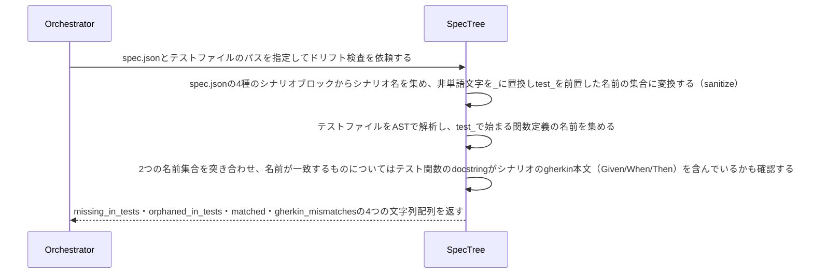

# スペックとテストシナリオの対応関係を検証する：CheckScenarioDrift

## 概要

- spec の TestScenarios（acceptanceScenarios/guaranteeScenarios/invariantScenarios/domainServiceScenarios）が宣言するシナリオ名と、対応するテストファイルの test_* 関数名を突き合わせ、未実装のシナリオ・宣言に対応しない孤立テストを機械的に検出する。

---

## 存在意義

- specのシナリオとテストコードの対応が検証されなければ、TDDの規律（spec→シナリオ→テスト→実装の順走）が守られているかを確認する手段が無くなる。specに書いたシナリオが実装されないまま放置される「順走の欠落」と、specに無い振る舞いが実装側の都合でテストとして固定される「逆走・抜け駆け実装」は、どちらも人手のレビューでは見逃されやすい。この2つを機械的に検知することで、仕様が実装を導くという開発順序そのものを保護する。

---

## 主アクターと意図

### 主アクター

Orchestrator（HarnessAgent）

### 意図

specのシナリオ宣言とテストコードの対応関係が保たれているかを確認したい

---

## 事前条件

- 対象 spec.json のパスと、対応するテストファイル(.py)のパスが両方与えられている

---

## 基本フロー



---

## 事後条件

- 返り値は次の4フィールドを持つ: missing_in_tests（specが宣言するが対応するテスト関数が無いシナリオ名）・orphaned_in_tests（テストファイルにあるがどのシナリオ宣言にも対応しない関数名）・matched（両方に存在する名前）・gherkin_mismatches（名前は一致するが、テスト関数のdocstringがシナリオのgherkin本文を含んでいないシナリオ名）
- 対象となるシナリオブロックはacceptanceScenarios/guaranteeScenarios/invariantScenarios/domainServiceScenariosの4種
- シナリオ名からテスト関数名への変換規則（sanitize）は、非単語文字を_に置換しtest_を前置する
- gherkin本文の比較は、gherkinの"Scenario: ..."（または"Scenario Outline: ..."）見出し行を除いた各行と、テスト関数のdocstringの各行を、前後の空白を無視して比較する（docstringがgherkin本文を含む連続した部分列であれば一致とみなす。docstringに追加の説明文が続いても構わない）
- テスト関数名・docstringの抽出はASTのみで行い、実行や意味理解はしない
- missing_in_tests・orphaned_in_tests・gherkin_mismatches全てが空配列であれば、シナリオとテストの対応関係が保たれている（正常系）

---

## 受け入れ基準

- When specが宣言するシナリオに対応するテスト関数がテストファイルに無いとき、システムはそのシナリオ名（sanitize後）をmissing_in_testsに含める shall。
- When テストファイルの関数が、どのシナリオ宣言にも対応しないとき、システムはその関数名をorphaned_in_testsに含める shall。
- When シナリオ名（sanitize後）とテスト関数名が一致するとき、システムはその名前をmatchedに含める shall。
- When 名前は一致するが、テスト関数のdocstringが対応するシナリオのgherkin本文を含んでいないとき、システムはそのシナリオ名をgherkin_mismatchesに含める shall。
- While 全シナリオに対応するテストが存在し、孤立テストもgherkin本文の不一致も無いとき、システムはmissing_in_tests・orphaned_in_tests・gherkin_mismatches全てを空配列で返す shall。
- If 対象のspec.jsonまたはテストファイルが存在しないとき、システムはINVALID_PATHエラーを返す shall。
- If テストファイルが構文解析できないとき、システムはINVALID_SOURCEエラーを返す shall。

---

## 操作保証

- When 対象のspec.jsonまたはテストファイルが存在しないとき、システムは INVALID_PATH エラーを返す shall（対象を特定し取得する解決プロセス自体の契約であり、複数のusecaseに共通する）。

---

## エラー

| コード | 条件 |
|---|---|
| `INVALID_SOURCE` | 対象のテストファイルが構文解析できない（Pythonのパーサでエラー） |
| `INVALID_JSON` | 対象のspec.jsonが存在するが不正なJSON（json.JSONDecodeError） |

---

## 受け入れシナリオ

### 全シナリオに対応するテストがあり孤立も無いとき整合していると判定する

| 分類 | 観点 |
|---|---|
| 正常系 | 整合：missing/orphaned両方空配列は正常系 |

```gherkin
Scenario: 全シナリオに対応するテストがあり孤立も無いとき整合していると判定する
  Given 宣言する全シナリオに対応するtest_*関数を持ち、docstringがgherkin本文と一致するテストファイル
  When ドリフト検査を実行する
  Then missing_in_tests・orphaned_in_tests・gherkin_mismatches全てが空配列で返る
```

### 宣言されたシナリオに対応するテストが無いことを検出する

| 分類 | 観点 |
|---|---|
| 異常系 | ドリフト：宣言はあるがテスト未実装 |

```gherkin
Scenario: 宣言されたシナリオに対応するテストが無いことを検出する
  Given シナリオを宣言するが対応するtest_*関数を持たないテストファイル
  When ドリフト検査を実行する
  Then missing_in_testsにそのシナリオ名（sanitize後）が含まれる
```

### 宣言に対応しないテスト関数を検出する

| 分類 | 観点 |
|---|---|
| 異常系 | ドリフト：テストはあるが宣言が無い |

```gherkin
Scenario: 宣言に対応しないテスト関数を検出する
  Given どのシナリオ宣言にも対応しないtest_*関数を含むテストファイル
  When ドリフト検査を実行する
  Then orphaned_in_testsにその関数名が含まれる
```

### docstringがgherkin本文と一致しないシナリオを検出する

| 分類 | 観点 |
|---|---|
| 異常系 | ドリフト：名前は一致するがGiven/When/Then本文がずれている |

```gherkin
Scenario: docstringがgherkin本文と一致しないシナリオを検出する
  Given シナリオに対応するtest_*関数を持つが、docstringの内容がgherkin本文と異なるテストファイル
  When ドリフト検査を実行する
  Then gherkin_mismatchesにそのシナリオ名が含まれる
```

### 構文解析できないテストファイルはINVALID_SOURCE

| 分類 | 観点 |
|---|---|
| 異常系 | エラー：テストファイルの構文エラー |

```gherkin
Scenario: 構文解析できないテストファイルはINVALID_SOURCE
  Given 構文が壊れたテストファイル
  When ドリフト検査を実行する
  Then INVALID_SOURCEエラーが返る
```

---

## 操作保証シナリオ

### 存在しないspec.jsonはINVALID_PATH

| 分類 | 観点 |
|---|---|
| 異常系 | エラー：spec.jsonの不在 |

```gherkin
Scenario: 存在しないspec.jsonはINVALID_PATH
  When 存在しないspec.jsonのパスでドリフト検査を実行する
  Then INVALID_PATHエラーが返る
```

### 存在しないテストファイルはINVALID_PATH

| 分類 | 観点 |
|---|---|
| 異常系 | エラー：テストファイルの不在 |

```gherkin
Scenario: 存在しないテストファイルはINVALID_PATH
  When 存在しないテストファイルのパスでドリフト検査を実行する
  Then INVALID_PATHエラーが返る
```
