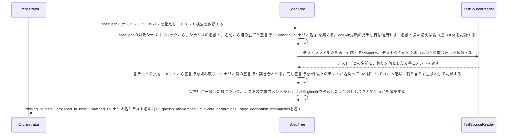

# スペックとテストシナリオの対応関係を検証する：CheckScenarioDrift

## 概要

- spec の TestScenarios（acceptanceScenarios/guaranteeScenarios/invariantScenarios/domainServiceScenarios）が宣言するシナリオ名と、対応するテストファイルの test_* 関数名を突き合わせ、未実装のシナリオ・宣言に対応しない孤立テストを機械的に検出する。

---

## 存在意義

- specのシナリオとテストコードの対応が検証されなければ、TDDの規律（spec→シナリオ→テスト→実装の順走）が守られているかを確認する手段が無くなる。specに書いたシナリオが実装されないまま放置される「順走の欠落」と、specに無い振る舞いが実装側の都合でテストとして固定される「逆走・抜け駆け実装」は、どちらも人手のレビューでは見逃されやすい。この2つを機械的に検知することで、仕様が実装を導くという開発順序そのものを保護する。

---

## 主アクターと意図

### 主アクター

Orchestrator（HarnessAgent）

### 意図

specのシナリオ宣言とテストコードの対応関係が保たれているかを確認したい

---

## 事前条件

- 1組だけ検査するときは、対象 spec.json のパスと、対応するテストファイルのパスが両方与えられている
- 全体を検査するときは、spec documentの置き場所と、テストの配置ルートが与えられている
- テストファイルの言語が、文書コメントの取り出しに対応している言語のいずれかである

---

## 入力

| 入力 | 説明 |
|---|---|
| `specPath` | spec.json のパス（1組だけ検査する） |
| `testPath` | 対応するテストファイルのパス（1組だけ検査する） |
| `documentsRoot` | spec documentの置き場所（全体を検査する） |
| `testsRoot` | テストの配置ルート（全体を検査する） |
| `architectureRef` | シナリオ照合の規約を引くarchitecture documentのdocumentId |

---

## 基本フロー


```mermaid
sequenceDiagram
    Orchestrator->>SpecTree: spec.jsonとテストファイルのパスを指定してドリフト検査を依頼する
    SpecTree->>SpecTree: spec.jsonの対象シナリオブロックから、シナリオの名前と、名前から組み立てた宣言行「Scenario: {シナリオ名}」を集める。gherkin先頭の見出し行は信用せず、名前と食い違えば食い違い自体を記録する
    SpecTree->>TestSourceReader: テストファイルの言語に対応するadapterへ、テストの名前と文書コメントの取り出しを依頼する
    TestSourceReader-->>SpecTree: テストごとの名前と、飾りを落とした文書コメントを返す
    SpecTree->>SpecTree: 各テストの文書コメントから宣言行を読み取り、シナリオ側の宣言行と突き合わせる。同じ宣言行を2件以上のテストが名乗っていれば、いずれかへ暗黙に割り当てず重複として記録する
    SpecTree->>SpecTree: 宣言行が一致した組について、テストの文書コメントがシナリオのgherkinを連続した部分列として含んでいるかを確認する
    SpecTree-->>Orchestrator: missing_in_tests・orphaned_in_tests・matched（シナリオ名とテスト名の対）・gherkin_mismatches・duplicate_declarations・spec_declaration_mismatchesを返す
```

---

## 事後条件

- 1組だけ検査したときの返り値は次の6フィールドを持つ: missing_in_tests（specが宣言するが対応するテストが無いシナリオ名）・orphaned_in_tests（どのシナリオ宣言にも対応しないテストの名前）・matched（シナリオ名とテスト名の対）・gherkin_mismatches（宣言行は一致するが文書コメントがgherkinを含まないシナリオ名）・duplicate_declarations（2件以上のテストが名乗った宣言行）・spec_declaration_mismatches（spec自身のgherkin先頭の宣言行が名前と食い違うシナリオ名）
- 全体を検査したときの返り値は、missing_test_file（宣言はあるが突き合わせる相手のテストファイルが無いシナリオブロック）と、results（相手が居た組それぞれの、1組検査と同じ6フィールドに文書の識別子を添えたもの）を持つ
- 全体を検査する手段を持つのは、他のドリフト検知（実装クラス・操作・集約・業務サービス・schema版）が既に全体走査であり、この検査だけが1組ずつという例外だったため。例外を1つ取り除く
- 1組だけ検査する呼び方も残す。書き込みのたびに全体を走査すると重くなるため、その場の検査と、一通り作り終えたときの品質確認とで使い分ける
- 突き合わせのキーは宣言行「Scenario: {シナリオ名}」であり、テストの名前は突き合わせに使わない。spec側の宣言行はシナリオの名前から組み立て、gherkin本文中の見出し行は信用しない（名前が二箇所に存在しうるため、名前を唯一の正とする）
- matchedはシナリオ名とテスト名の対で返す。2本の配列を並べて位置で対応させる形にはしない（位置の対応という誰も検査しない前提が生まれるため）
- テストの名前は対象言語の命名慣習に従った任意の識別子でよく、シナリオ名との一致を要求しない
- 対象となるシナリオブロックは、テストファイルのパスパターンから機械的に絞り込む: tests/acceptance/配下はacceptanceScenariosのみ、tests/integration/配下はguaranteeScenariosのみ、tests/unit/配下はinvariantScenarios・domainServiceScenariosの2種、いずれにも一致しない場合は4種全てを対象にする（配置の規約と機械的に対応させる。ケースバイケースの判定はしない）
- gherkinの比較は、gherkinの各行と、テストの文書コメントの各行を、前後の空白を無視して比較する（文書コメントがgherkinを含む連続した部分列であれば一致とみなす。追加の説明文が前後に続いても構わない）。gherkinの見出し行を除外しない——見出し行は突き合わせのキーそのものであり、転記の対象から外すと、キーがテストの中に現れなくなる
- テストの名前と文書コメントの取り出しは、対象言語ごとのadapterが担う。この操作自体は言語の構文解析技術を知らない
- 文書コメントが関数の内側に置かれる言語（Python）では、コメントとテストの対応は構造的に決まる。関数の直前に置かれる言語（Java/TypeScript/JavaScript）では直前の兄弟であることによって決まり、間に別のコメントや文が挟まると対応しなくなる（対応しない場合は孤立と未実装の両方で報告されるため、黙って通ることはない）
- 取り出しは構文解析のみで行い、実行や意味理解はしない

---

## 受け入れ基準

- When specが宣言するシナリオの宣言行に対応するテストがテストファイルに無いとき、システムはそのシナリオ名をmissing_in_testsに含める shall。
- When テストが宣言行を持たない、またはその宣言行がどのシナリオにも対応しないとき、システムはそのテストの名前をorphaned_in_testsに含める shall。
- When シナリオの宣言行とテストの宣言行が一致するとき、システムはそのシナリオ名とテスト名の対をmatchedに含める shall。
- When 宣言行は一致するが、テストの文書コメントが対応するシナリオのgherkinを含んでいないとき、システムはそのシナリオ名をgherkin_mismatchesに含める shall。
- When 同一の宣言行を持つテストが2件以上あるとき、システムはその宣言行をduplicate_declarationsに含め、いずれか一方へ暗黙に割り当てない shall。
- When specのシナリオのgherkin先頭にある宣言行が、そのシナリオの名前と一致しないとき、システムはそのシナリオ名をspec_declaration_mismatchesに含める shall。
- While missing_in_tests・orphaned_in_tests・gherkin_mismatches・duplicate_declarations・spec_declaration_mismatchesの全てが空のとき、システムはシナリオとテストの対応が保たれていると判定する shall。
- When spec documentの置き場所とテストの配置ルートが与えられたとき、システムは配下の全specを走査し、シナリオを宣言する各ブロックについて、配置の規約が定めるテストファイルの有無を確かめる shall。
- When 走査したシナリオブロックに対応するテストファイルが存在しないとき、システムはその文書の識別子・ブロック種別・期待した配置・シナリオ件数をmissing_test_fileに含める shall（宣言はあるが突き合わせる相手が居ないことを、対応が取れていることと区別する）。
- When 走査したシナリオブロックに対応するテストファイルが存在するとき、システムはその組について1組の検査と同じ判定を行い、文書の識別子を添えてresultsに含める shall。
- If 1組だけ検査する指定と全体を検査する指定の両方が与えられた、またはどちらも与えられなかったとき、システムはMISSING_PARAMエラーを返す shall。
- If 対象のspec.jsonまたはテストファイルが存在しないとき、システムはINVALID_PATHエラーを返す shall。
- If テストファイルが構文解析できないとき、システムはINVALID_SOURCEエラーを返す shall。
- If テストファイルの言語が文書コメントの取り出しに対応していないとき、システムはUNSUPPORTED_LANGUAGEエラーを返す shall。
- While test_file_pathがtests/acceptance/配下のとき、システムはacceptanceScenariosのみを対象にシナリオ突き合わせを行う shall。
- While test_file_pathがtests/integration/配下のとき、システムはguaranteeScenariosのみを対象にシナリオ突き合わせを行う shall。
- While test_file_pathがtests/unit/配下のとき、システムはinvariantScenarios・domainServiceScenariosを対象にシナリオ突き合わせを行う shall。
- While test_file_pathがいずれのパターンにも一致しないとき、システムは4種のシナリオブロック全てを対象にシナリオ突き合わせを行う shall。

---

## 操作保証

- When 対象のspec.jsonまたはテストファイルが存在しないとき、システムは INVALID_PATH エラーを返す shall（対象を特定し取得する解決プロセス自体の契約であり、複数のusecaseに共通する）。

---

## エラー

| コード | 条件 |
|---|---|
| `MISSING_PARAM` | - 1組だけ検査する指定と全体を検査する指定の両方が与えられた<br>- 1組だけ検査する指定と全体を検査する指定のどちらも与えられなかった |
| `INVALID_SOURCE` | - 対象のテストファイルが構文解析できない |
| `INVALID_JSON` | - 対象のspec.jsonが存在するが不正なJSON |
| `UNSUPPORTED_LANGUAGE` | - テストファイルの言語に対応するadapterが無い |

---

## 受け入れシナリオ

### 背景

対象のspec.jsonと、対応するテストファイルが与えられている。テストは文書コメントの先頭に宣言行「Scenario: {シナリオ名}」を持つ。

### 宣言行が揃っていれば対応していると判定する

| 分類 | 観点 |
|---|---|
| 正常系 | 整合: 検知の全カテゴリが空であることが「対応が取れている」の定義 |

```gherkin
Scenario: 宣言行が揃っていれば対応していると判定する
  Given 宣言する全シナリオの宣言行を持ち、gherkinも転記されたテストファイル
  When ドリフト検査を実行する
  Then missing_in_tests・orphaned_in_tests・gherkin_mismatches・duplicate_declarations・spec_declaration_mismatchesが全て空で返る
  And matchedにシナリオ名とテスト名の対が含まれる
```

### テストの名前がシナリオ名と違っても対応づく

| 分類 | 観点 |
|---|---|
| 正常系 | 計算整合: 名前を突き合わせに使わないことの証明。この一点が今回の変更の核心 |

```gherkin
Scenario: テストの名前がシナリオ名と違っても対応づく
  Given シナリオ名と全く異なる名前を持ち、宣言行だけが一致するテスト
  When ドリフト検査を実行する
  Then そのシナリオはmatchedに含まれる
  And missing_in_testsにもorphaned_in_testsにも現れない
```

### 宣言されたシナリオに対応するテストが無いことを検出する

| 分類 | 観点 |
|---|---|
| 異常系 | ドリフト: 順走の欠落（specにあって実装が無い） |

```gherkin
Scenario: 宣言されたシナリオに対応するテストが無いことを検出する
  Given シナリオを宣言するが、その宣言行を持つテストが無いテストファイル
  When ドリフト検査を実行する
  Then missing_in_testsにそのシナリオ名が含まれる
```

### 宣言行を持たないテストを孤立として検出する

| 分類 | 観点 |
|---|---|
| 異常系 | ドリフト: 逆走・抜け駆け実装（specに無い振る舞いがテストで固定される） |

```gherkin
Scenario: 宣言行を持たないテストを孤立として検出する
  Given 文書コメントが無い、または宣言行を持たないテストを含むテストファイル
  When ドリフト検査を実行する
  Then orphaned_in_testsにそのテストの名前が含まれる
```

### 宣言行を持たないテストが複数あっても全件が孤立として並ぶ

| 分類 | 観点 |
|---|---|
| 境界値 | 境界: 宣言行が無い状態を空文字として扱うと、複数件が1件へ潰れて黙って消える |

```gherkin
Scenario: 宣言行を持たないテストが複数あっても全件が孤立として並ぶ
  Given 宣言行を持たないテストを2件含むテストファイル
  When ドリフト検査を実行する
  Then orphaned_in_testsに2件とも含まれる
```

### シナリオ名だけを変えたときは未実装と孤立の両方で現れる

| 分類 | 観点 |
|---|---|
| 境界値 | 状態遷移: 改名は「別のシナリオになった」として扱う。黙って追従しない |

```gherkin
Scenario: シナリオ名だけを変えたときは未実装と孤立の両方で現れる
  Given specのシナリオ名を変更し、テスト側の宣言行を変更していない状態
  When ドリフト検査を実行する
  Then missing_in_testsに新しいシナリオ名が含まれる
  And orphaned_in_testsにそのテストの名前が含まれる
  And gherkin_mismatchesには含まれない
```

### gherkin本文だけを変えたときは文言不一致として現れる

| 分類 | 観点 |
|---|---|
| 境界値 | 計算整合: 同一性の軸（宣言行）と内容の軸（gherkin）が独立していることの証明 |

```gherkin
Scenario: gherkin本文だけを変えたときは文言不一致として現れる
  Given specのgherkinのGiven/When/Thenを変更し、宣言行は変更していない状態
  When ドリフト検査を実行する
  Then gherkin_mismatchesにそのシナリオ名が含まれる
  And missing_in_testsには含まれない
```

### 本文が同一の2シナリオを宣言行で区別する

| 分類 | 観点 |
|---|---|
| 境界値 | 境界: 本文をキーにすると区別できない組。実データに現に存在する |

```gherkin
Scenario: 本文が同一の2シナリオを宣言行で区別する
  Given Given/When/Thenが完全に同一で、名前だけが異なる2つのシナリオ
  And それぞれに対応する宣言行を持つ2つのテスト
  When ドリフト検査を実行する
  Then 2つのシナリオがそれぞれ正しいテストとmatchedになる
```

### 同じ宣言行を名乗るテストが2件あれば重複として報告する

| 分類 | 観点 |
|---|---|
| 異常系 | 境界: どちらへ割り当てるかを暗黙に決めると、割り当て順という本質と無関係な要因で検知結果が変わる |

```gherkin
Scenario: 同じ宣言行を名乗るテストが2件あれば重複として報告する
  Given 同一の宣言行を持つテストを2件含むテストファイル
  When ドリフト検査を実行する
  Then duplicate_declarationsにその宣言行が含まれる
```

### spec自身の宣言行が名前と食い違えば報告する

| 分類 | 観点 |
|---|---|
| 異常系 | 事前条件: 名前がシナリオの名前とgherkin見出しの二箇所に存在するため、どちらが正かを機械が決められる状態を保つ |

```gherkin
Scenario: spec自身の宣言行が名前と食い違えば報告する
  Given シナリオの名前と、gherkin先頭の宣言行が異なるspec
  When ドリフト検査を実行する
  Then spec_declaration_mismatchesにそのシナリオ名が含まれる
```

### 文書コメントの飾りを落としてから宣言行を読む

| 分類 | 観点 |
|---|---|
| 境界値 | 境界: 飾りの形は言語ごとに違い、落とし方を誤ると「宣言行が無い」と誤判定する |

```gherkin
Scenario: 文書コメントの飾りを落としてから宣言行を読む
  Given 対象言語の文書コメント記法で宣言行を書いたテスト
  When ドリフト検査を実行する
  Then その宣言行がシナリオと対応づく
```

### 文書コメントが関数の直前に置かれる言語でも対応づく

| 分類 | 観点 |
|---|---|
| 正常系 | 計算整合: 対応づけの根拠が言語で異なる（内側にある＝構造的、直前にある＝近接） |

```gherkin
Scenario: 文書コメントが関数の直前に置かれる言語でも対応づく
  Given 文書コメントを関数の直前に置く言語のテストファイル
  And 宣言行を持つテストと持たないテストが並んでいる
  When ドリフト検査を実行する
  Then 宣言行を持つテストだけがmatchedになる
  And 直前のコメントが後続の別のテストへ取り違えられない
```

### シナリオが無いspecと、テストが無いファイルは空の判定になる

| 分類 | 観点 |
|---|---|
| 境界値 | 境界: 退化したケースをエラーにしない |

```gherkin
Scenario: シナリオが無いspecと、テストが無いファイルは空の判定になる
  Given シナリオを1件も宣言しないspecと、テストを1件も含まないファイル
  When ドリフト検査を実行する
  Then 全てのカテゴリが空で返る
  And エラーにならない
```

### 構文解析できないテストファイルはINVALID_SOURCE

| 分類 | 観点 |
|---|---|
| 異常系 | エラー: テストファイルが解析不能 |

```gherkin
Scenario: 構文解析できないテストファイルはINVALID_SOURCE
  Given 構文が壊れているテストファイル
  When ドリフト検査を実行する
  Then INVALID_SOURCEエラーが返る
```

### 対応する言語が無ければUNSUPPORTED_LANGUAGE

| 分類 | 観点 |
|---|---|
| 異常系 | エラー: 取り出しに対応していない言語。黙って空の判定を返すと、検査していないことが綺麗であることと同じ見た目になる |

```gherkin
Scenario: 対応する言語が無ければUNSUPPORTED_LANGUAGE
  Given 文書コメントの取り出しに対応していない言語のテストファイル
  When ドリフト検査を実行する
  Then UNSUPPORTED_LANGUAGEエラーが返る
  And 空の判定を返さない
```

### 全体を検査すると相手のいないシナリオが並ぶ

| 分類 | 観点 |
|---|---|
| 正常系 | 計算整合: 書き込み起点の検査では、誰も触らないシナリオが永久に検査されない。全体走査はその穴を埋める |

```gherkin
Scenario: 全体を検査すると相手のいないシナリオが並ぶ
  Given シナリオを宣言するが、配置の規約が定めるテストファイルが存在しないspec
  When spec documentの置き場所とテストの配置ルートを指定して検査する
  Then missing_test_fileにその文書の識別子とブロック種別とシナリオ件数が含まれる
```

### 全体を検査すると相手が居た組の判定が並ぶ

| 分類 | 観点 |
|---|---|
| 正常系 | 計算整合: 相手が居る組は1組検査と同じ判定になる。全体走査で判定が変わらない |

```gherkin
Scenario: 全体を検査すると相手が居た組の判定が並ぶ
  Given 配置の規約が定めるテストファイルが存在するspec
  When spec documentの置き場所とテストの配置ルートを指定して検査する
  Then resultsにその文書の識別子と、1組で検査したときと同じ6フィールドが含まれる
```

### 1組の指定と全体の指定を同時に渡すと拒む

| 分類 | 観点 |
|---|---|
| 異常系 | 事前条件: どちらの検査をするかが決まらない状態で、片方を暗黙に選ばない |

```gherkin
Scenario: 1組の指定と全体の指定を同時に渡すと拒む
  Given specとテストファイルの組の指定と、置き場所の指定の両方
  When ドリフト検査を実行する
  Then MISSING_PARAMエラーが返る
```

### どちらの指定も渡さないと拒む

| 分類 | 観点 |
|---|---|
| 異常系 | 境界: 何も指定されないときに空の判定を返さない |

```gherkin
Scenario: どちらの指定も渡さないと拒む
  Given 組の指定も置き場所の指定も無い
  When ドリフト検査を実行する
  Then MISSING_PARAMエラーが返る
  And 空の判定を返さない
```

### 受け入れの層のテストは受け入れシナリオだけを対象にする

| 分類 | 観点 |
|---|---|
| 境界値 | 事前条件: 対象ブロックはパスから機械的に絞る。コードの性質で判定しない |

```gherkin
Scenario: 受け入れの層のテストは受け入れシナリオだけを対象にする
  Given 受け入れシナリオと保証シナリオの両方を宣言するspec
  And 受け入れの層に配置され、受け入れシナリオだけを実装したテストファイル
  When ドリフト検査を実行する
  Then 保証シナリオはmissing_in_testsに含まれない
```

### 統合の層のテストは保証シナリオだけを対象にする

| 分類 | 観点 |
|---|---|
| 境界値 | 事前条件: 同上。層ごとに対象ブロックが決まる |

```gherkin
Scenario: 統合の層のテストは保証シナリオだけを対象にする
  Given 受け入れシナリオと保証シナリオの両方を宣言するspec
  And 統合の層に配置され、保証シナリオだけを実装したテストファイル
  When ドリフト検査を実行する
  Then 受け入れシナリオはmissing_in_testsに含まれない
```

### 既知の配置に当てはまらないパスは全種を対象にする

| 分類 | 観点 |
|---|---|
| 境界値 | 境界: 絞り込めないときに黙って一部だけ見る形にしない |

```gherkin
Scenario: 既知の配置に当てはまらないパスは全種を対象にする
  Given 受け入れシナリオと保証シナリオの両方を宣言するspec
  And いずれの層の配置にも当てはまらないテストファイル
  When ドリフト検査を実行する
  Then 保証シナリオがmissing_in_testsに含まれる
```

---

## 操作保証シナリオ

### 存在しないspec.jsonはINVALID_PATH

| 分類 | 観点 |
|---|---|
| 異常系 | エラー：spec.jsonの不在 |

```gherkin
Scenario: 存在しないspec.jsonはINVALID_PATH
  When 存在しないspec.jsonのパスでドリフト検査を実行する
  Then INVALID_PATHエラーが返る
```

### 存在しないテストファイルはINVALID_PATH

| 分類 | 観点 |
|---|---|
| 異常系 | エラー：テストファイルの不在 |

```gherkin
Scenario: 存在しないテストファイルはINVALID_PATH
  When 存在しないテストファイルのパスでドリフト検査を実行する
  Then INVALID_PATHエラーが返る
```
