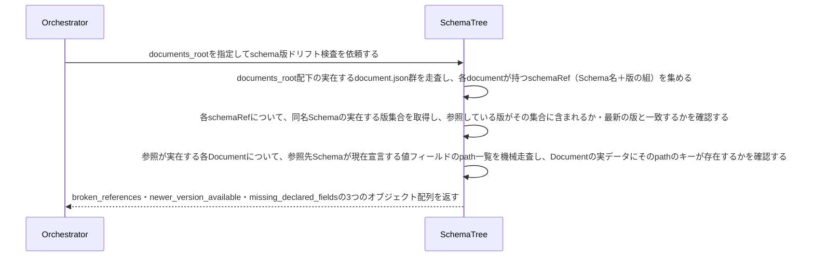

# DocumentとSchema版の対応関係を検証する：CheckSchemaVersionDrift

## 概要

- Document の schema 参照を、実在する Schema の版と突き合わせ、指す先の無い参照・最新でない参照・追従していない欄を機械的に検出する。
- 最新でない参照は情報ではなく違反として上げる。古いまま置くことに帰結が無いと、版はいつまでも追いつかない。

---

## 存在意義

- schemaが版を重ねて進化しても、既存のDocumentが古い版を参照したまま放置されれば、そのズレは誰にも気づかれない。破壊的変更のたびに全文書を手作業で洗い直すのは現実的でなく、この検知が無ければschemaの改版履歴が実データに反映されているかを確認する手段自体が存在しないことになる。

---

## 主アクターと意図

### 主アクター

Orchestrator（HarnessAgent）

### 意図

Documentが参照するSchemaの版が実在し、かつ最新であるかを確認したい

---

## 事前条件

- Document集約の実インスタンス群を走査する対象ディレクトリ（documents_root）が与えられている

---

## 入力

| 入力 | 説明 |
|---|---|
| `documentsRoot` | Documentの実インスタンス群を走査する対象ディレクトリ |

---

## 基本フロー



---

## 事後条件

- 返り値は次の3フィールドを持つ: broken_references（schemaRefが指す版が実在しないDocumentの組）・newer_version_available（schemaRefは実在するが、同名Schemaの最新版ではないDocumentの組。参照先の最新schemaRefも併せて含む）・missing_declared_fields（参照先Schemaが現在宣言する値フィールドのpathを、Documentの実データが持たない組）
- 版の新旧比較は、版識別子（例: v2）から取り出した数値の大小で行う（文字列としての辞書順比較はしない。'v10'と'v2'の大小を誤らないため）
- schemaRefを持たないDocumentは対象外とする（MISSING_SCHEMA_REFの判定は本usecaseの対象外）
- missing_declared_fieldsは、schemaRefが実在する参照が指すSchema自体（versionの新旧は問わない）に対して確認する。参照先Schemaのfill対象path一覧（値フィールドのpath×discriminator分岐）のうち、Documentの実データがそのキーを持たないものを報告する
- broken_references・newer_version_available・missing_declared_fieldsが全て空配列であれば、全DocumentのSchema参照が最新かつ実在し、宣言済みフィールドにも追従している（正常系）

---

## 受け入れ基準

| 基準 |
|---|
| When Documentのschema参照が指す版が実在しないとき、システムはその組を、指す先の無い参照として返す shall。 |
| When Documentが最新でない版を指しているとき、システムはその組を、追いついていない参照として返す shall。 |
| When 参照先Schemaが宣言する値フィールドのpathを、Documentの実データが持たないとき、システムはその組を、追従していない欄として返す shall。 |
| When いずれかの一覧が空でないとき、システムは追従できていないという判定を結果に含める shall（一覧を並べるだけでは、呼び出し側が失敗として扱えず、古いまま置くことに帰結が生まれない）。 |
| While 全Documentのschema参照が実在しかつ最新であり、宣言済みフィールドにも追従しているとき、システムは全ての一覧を空で返し、追従できているという判定を返す shall。 |
| If 走査の対象が存在しないとき、システムは INVALID_PATH エラーを返す shall。 |

---

## エラー

| コード | 条件 |
|---|---|
| `INVALID_PATH` | - 対象のdocuments_rootが存在しないとき |

---

## 受け入れシナリオ

### 追従できていれば全て空で、判定も追従済みになる

| 分類 | 観点 |
|---|---|
| 正常系 | 判定：揃っているときに余計な失敗を出さないか |

```gherkin
Scenario: 追従できていれば全て空で、判定も追従済みになる
  Given 全Documentが最新の版を指し、宣言済みの欄も揃っている置き場所
  When 版の追従を調べる
  Then 全ての一覧が空で、追従できているという判定が返る
```

### 実在しない版を指す参照を見つける

| 分類 | 観点 |
|---|---|
| 異常系 | 参照の実在：指す先の無い参照を見つけられるか |

```gherkin
Scenario: 実在しない版を指す参照を見つける
  Given 実在しない版を指すDocument
  When 版の追従を調べる
  Then その組が指す先の無い参照として返り、追従できていないという判定が返る
```

### 最新でない版を指す参照を見つける

| 分類 | 観点 |
|---|---|
| 異常系 | 版の追従：古いまま置かれた参照を見つけられるか |

```gherkin
Scenario: 最新でない版を指す参照を見つける
  Given 最新でない版を指すDocument
  When 版の追従を調べる
  Then その組が追いついていない参照として返り、追従できていないという判定が返る
```

### 宣言された欄を持たないDocumentを見つける

| 分類 | 観点 |
|---|---|
| 異常系 | 欄の追従：宣言に実データが追いついていないことを見つけられるか |

```gherkin
Scenario: 宣言された欄を持たないDocumentを見つける
  Given Schemaが宣言する必須の欄を持たないDocument
  When 版の追従を調べる
  Then その組が追従していない欄として返り、追従できていないという判定が返る
```

### 走査の対象が無ければINVALID_PATH

| 分類 | 観点 |
|---|---|
| 異常系 | エラー：走査の対象が実在しないとき |

```gherkin
Scenario: 走査の対象が無ければINVALID_PATH
  Given 実在しない走査の対象
  When 版の追従を調べる
  Then INVALID_PATH エラーが返る
```
