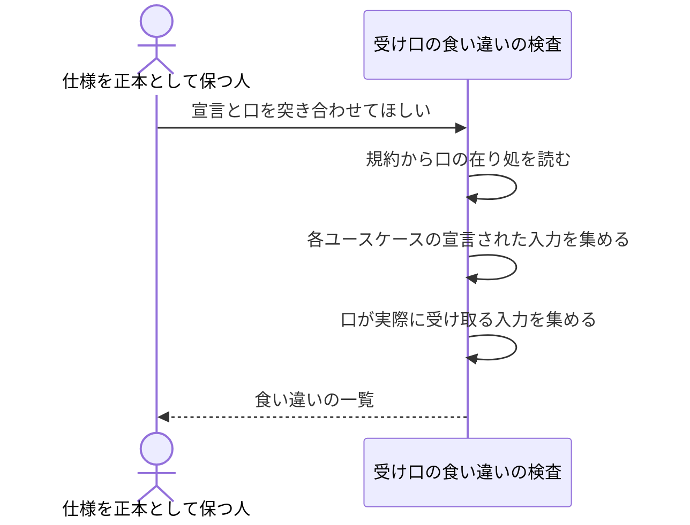

# 受け口が見せる入力と宣言の食い違いを見つける：uc-check-surface-drift

## 概要

- ユースケースが宣言する入力と、その操作を外へ差し出している口が実際に受け取る入力を突き合わせ、宣言に無い入力・宣言されているのに口に無い入力を機械的に見つける。
- 口の種類（命令行・道具呼び出し・要求本文など）は問わない。どの口も同じ宣言を指しているかだけを見る。

---

## 存在意義

- 同じ操作が口ごとに違う名前の入力を見せていても、いま誰も気づかない。実際に、ある操作の同じ入力が一方の口では『解決済みの道』、もう一方では『実際の道』という別の名前になっていた。使う人はそれが同じものだと分からない。
- 入力の説明が口の中にしか無いと、仕様を直しても口が古い説明を見せ続ける。正本がどちらか決まっていない状態では、食い違ったときにどちらを直すかも決まらない。

---

## 主アクターと意図

### 主アクター

仕様を正本として保つ人

### 意図

外から呼ばれる口が、仕様の宣言どおりの入力を見せているかを確かめたい

---

## 事前条件

- 対象のユースケース仕様に、外から渡す値が宣言されている
- 構成の規約が、外へ差し出す口がどこにあるかを宣言している

---

## 入力

| 入力 | 説明 |
|---|---|
| `documentsRoot` | 突き合わせの対象とするユースケース仕様が置かれている場所 |
| `architectureRef` | 外へ差し出す口の在り処を宣言している構成の規約への参照 |
| `language` | 口のソースが書かれている言語 |

---

## 基本フロー



---

## 事後条件

- 宣言と口の食い違いが、種別ごとに分かれた一覧として得られている
- 対象の仕様も口も、この操作によって書き換えられていない

---

## 受け入れ基準

- When 宣言された入力が、その操作を差し出す口のどこにも見つからないとき、システムはその組を missing_input に含める shall。
- If 口が受け取る入力が、対応するユースケースのどこにも宣言されていないとき、システムはその組を undeclared_input に含める shall。
- While 名前を突き合わせるとき、システムは区切りと大文字小文字の違いを無視して同じ名前とみなす shall（同じ入力が口ごとに違う綴りで現れるため。どの綴りが正しいかはこの操作の関心ではない）。
- While ある操作を複数の口が差し出しているとき、システムは口ごとに突き合わせ、どの口の話かを報告に含める shall（片方の口だけが宣言と食い違う場合があるため）。
- While 入力を1つも宣言していないユースケースがあるとき、システムはそのユースケースを突き合わせの対象から外す shall（宣言が無ければ突き合わせようがない）。
- While 全ての口が宣言どおりの入力を見せているとき、システムは2つの一覧を空配列で返す shall。
- If 対象の置き場所または規約への参照が解決できないとき、システムはINVALID_PATH エラーを返す shall。

---

## 操作保証

- When 受け口の食い違いを調べたとき、システムは対象の仕様も口も書き換えない shall。
- While 同じ仕様と同じ口に対して繰り返し調べたとき、システムは常に同じ一覧を返す shall。

---

## エラー

| コード | 条件 |
|---|---|
| `INVALID_PATH` | - 仕様の置き場所が存在しない、またはパストラバーサルを含む |
| `ARCHITECTURE_REF_NOT_FOUND` | - 構成の規約への参照が解決できない |

---

## 受け入れシナリオ

### 宣言された入力が口に無いことを見つける

| 分類 | 観点 |
|---|---|
| 異常系 | 正本への追随：宣言を足しても口が追いついていない状態を捕まえる |

```gherkin
Scenario: 宣言された入力が口に無いことを見つける
  Given ある入力を宣言しているユースケース仕様
  And その入力を受け取らない口
  When 受け口の食い違いを調べる
  Then その組が missing_input に現れる
  And どの口の話かが報告に含まれている
```

### 宣言に無い入力を口が受け取っていることを見つける

| 分類 | 観点 |
|---|---|
| 異常系 | 正本への追随：口が勝手に増やした入力を捕まえる |

```gherkin
Scenario: 宣言に無い入力を口が受け取っていることを見つける
  Given 入力を1つだけ宣言しているユースケース仕様
  And 宣言に無い入力も受け取る口
  When 受け口の食い違いを調べる
  Then その組が undeclared_input に現れる
```

### 綴りが違っても同じ入力とみなす

| 分類 | 観点 |
|---|---|
| 境界値 | 誤検知を出さない：綴りの流儀はこの操作の関心ではない |

```gherkin
Scenario: 綴りが違っても同じ入力とみなす
  Given 区切り記号つきの綴りで入力を受け取る口
  And 大文字区切りの綴りで同じ入力を受け取る別の口
  When 受け口の食い違いを調べる
  Then どちらも宣言と一致したものとして扱われる
  And 2つの一覧は空のままである
```

### 入力を宣言していないユースケースは対象外

| 分類 | 観点 |
|---|---|
| 境界値 | 宣言が無ければ突き合わせない：無宣言を違反として扱わない |

```gherkin
Scenario: 入力を宣言していないユースケースは対象外
  Given 入力を1つも宣言していないユースケース仕様
  And その操作を差し出す口
  When 受け口の食い違いを調べる
  Then そのユースケースは2つの一覧のどちらにも現れない
```

### 全て揃っていれば空を返す

| 分類 | 観点 |
|---|---|
| 正常系 | 自己整合：揃っている状態で余計な報告を出さない |

```gherkin
Scenario: 全て揃っていれば空を返す
  Given 全ての口が宣言どおりの入力を見せている状態
  When 受け口の食い違いを調べる
  Then missing_input と undeclared_input はどちらも空である
```

---

## 操作保証シナリオ

### 調べても何も書き換えない

| 分類 | 観点 |
|---|---|
| 正常系 | 読み取り専用：確かめる操作が対象を変えてしまわない |

```gherkin
Scenario: 調べても何も書き換えない
  Given 食い違いを含む仕様と口
  When 受け口の食い違いを調べる
  Then 仕様の中身は調べる前と同じである
  And 口の中身も調べる前と同じである
```

### 繰り返し調べても同じ結果になる

| 分類 | 観点 |
|---|---|
| 正常系 | べき等性：報告が呼び出しの回数で変わらない |

```gherkin
Scenario: 繰り返し調べても同じ結果になる
  Given 食い違いを含む仕様と口
  When 受け口の食い違いを続けて2回調べる
  Then 2回の結果は同じである
```
