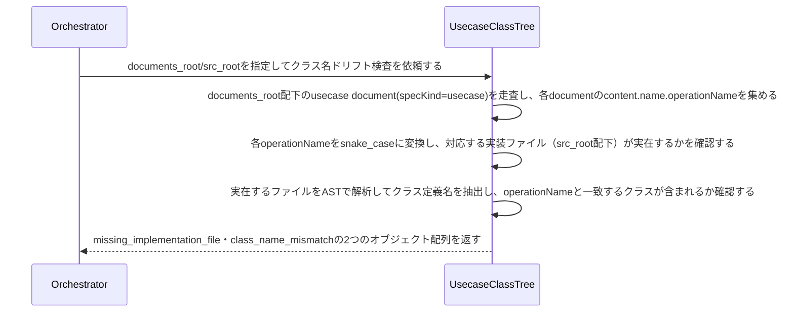

# 操作名と実装クラス名の一致を検証する：CheckUsecaseClassDrift

## 概要

- usecase specが宣言する操作名(operationName)と、対応する実装クラスが実際に持つクラス名が一致しているかを機械的に検証する。宣言と実装クラスの対応関係という、他のどのreconcile usecaseも見ていない盲点を検出する。

---

## 存在意義

- usecase specのoperationNameと実装クラス名が乖離したまま放置されると、specが実装から乖離した「違うモデル」を宣言し続けることになり、DDDのモデル駆動設計（モデルはコードに宿る）の前提が崩れる。この検知が無ければ、リネームの片方だけ反映し忘れる、といった典型的なドリフトに誰も気づけない。

---

## 主アクターと意図

### 主アクター

Orchestrator（HarnessAgent）

### 意図

usecase specの操作名と実装クラス名が一致しているかを確認したい

---

## 事前条件

- Document集約の実インスタンス群を走査する対象ディレクトリ（documents_root）が与えられている
- usecase実装クラスの配置ルートディレクトリ（src_root）が与えられている
- 実装言語（language）が与えられている。省略時はpython

---

## 基本フロー



---

## 事後条件

- 返り値は次の2フィールドを持つ: missing_implementation_file（operationNameから導出したファイルパスが実在しないusecaseの組）・class_name_mismatch（実装ファイルは実在するが、operationNameと一致するクラス定義が含まれていないusecaseの組）
- ファイルパスの導出は、operationNameをsnake_caseに変換し（例: CheckScenarioDrift→check_scenario_drift）、src_root配下に{name}.pyとして配置されている前提で行う
- クラス名の抽出はASTのみで行い、実行や意味理解はしない（宣言された名前と、実装ファイル内に存在するクラス定義名の機械的な突き合わせのみ）
- missing_implementation_file・class_name_mismatchの両方が空配列であれば、全usecaseの操作名と実装クラスが一致している（正常系）

---

## 受け入れ基準

- When usecase specのoperationNameから導出したファイルパスが実在しないとき、システムはその組をmissing_implementation_fileに含める shall。
- When 実装ファイルは実在するが、operationNameと一致するクラス定義がそのファイル内に見つからないとき、システムはその組をclass_name_mismatchに含める shall。
- While 全usecaseの操作名と実装クラスが一致しているとき、システムはmissing_implementation_file・class_name_mismatch両方を空配列で返す shall。
- If 対象のdocuments_rootまたはsrc_rootが存在しないとき、システムはINVALID_PATHエラーを返す shall。
- If languageがサポート対象外のとき、システムはUNSUPPORTED_LANGUAGEエラーを返す shall。
- While languageが指定されないとき、システムはpythonとして扱う shall。

---

## 操作保証

- When 対象のdocuments_rootまたはsrc_rootが存在しないとき、システムは INVALID_PATH エラーを返す shall（対象を特定し取得する解決プロセス自体の契約であり、複数のusecaseに共通する）。

---

## エラー

| コード | 条件 |
|---|---|
| `INVALID_PATH` | documents_rootまたはsrc_rootが存在しない、またはパストラバーサルを含む |
| `UNSUPPORTED_LANGUAGE` | languageがサポート対象外（python/java/typescript/javascript以外） |

---

## 受け入れシナリオ

### 全usecaseの操作名と実装クラスが一致するとき差分なしと判定する

| 分類 | 観点 |
|---|---|
| 正常系 | 整合：全operationNameが対応する実装ファイル内の同名クラスと一致するとき正常系（空配列） |

```gherkin
Scenario: 全usecaseの操作名と実装クラスが一致するとき差分なしと判定する
  Given 全usecaseのoperationNameが、対応する実装ファイル内の同名クラスと一致するspecツリー
  When クラス名ドリフト検査を実行する
  Then missing_implementation_file・class_name_mismatch両方が空配列で返る
```

### 実装ファイルが存在しないusecaseを検出する

| 分類 | 観点 |
|---|---|
| 異常系 | ドリフト：operationNameから導出したファイルが実在しない |

```gherkin
Scenario: 実装ファイルが存在しないusecaseを検出する
  Given operationNameから導出したファイルパスに対応する実装ファイルが実在しないusecase document
  When クラス名ドリフト検査を実行する
  Then missing_implementation_fileにその組が含まれる
```

### クラス名が一致しないusecaseを検出する

| 分類 | 観点 |
|---|---|
| 異常系 | ドリフト：実装ファイルは実在するがoperationNameと一致するクラスが無い |

```gherkin
Scenario: クラス名が一致しないusecaseを検出する
  Given 実装ファイルは実在するが、operationNameと一致するクラス定義を持たないusecase document
  When クラス名ドリフト検査を実行する
  Then class_name_mismatchにその組が含まれる
```

---

## 操作保証シナリオ

### 存在しないdocuments_rootはINVALID_PATH

| 分類 | 観点 |
|---|---|
| 異常系 | エラー：走査起点の不在 |

```gherkin
Scenario: 存在しないdocuments_rootはINVALID_PATH
  When 存在しないdocuments_rootでクラス名ドリフト検査を実行する
  Then INVALID_PATHエラーが返る
```
