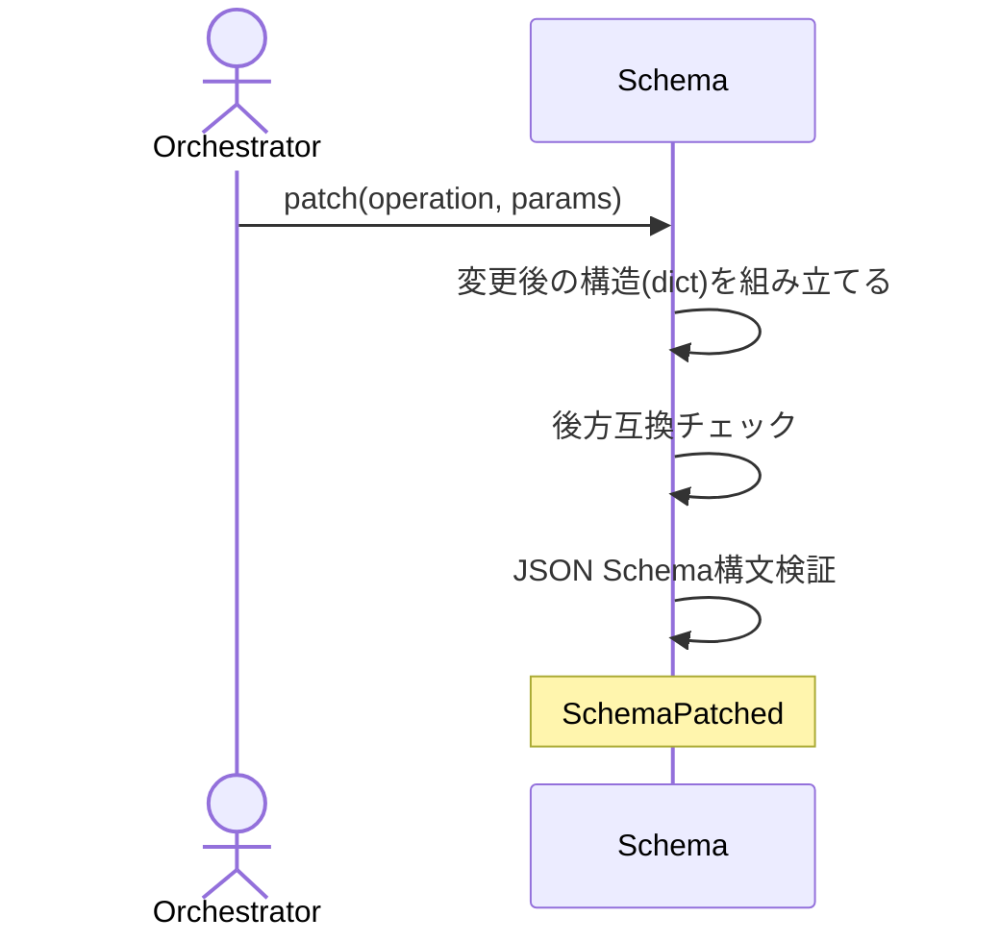

# Schema定義ファイルを安全に部分編集する：PatchSchema

## 概要

- 既存のSchema定義ファイルに対し、新規ブロック追加（add_block）・識別子リネーム（rename_block）・既存ブロックの1フィールド書き換え（set_field）という構造化操作を、対象外の箇所を一切変更せず（最小diff）、後方互換チェック・JSON Schema構文検証を通過した場合のみ適用する。AIはブロック定義・識別子名・書き換える値だけを与え、schemaファイル内の他の記述には一切触れない。

---

## 存在意義

- document.jsonは「AIは値だけ、構造は機械が守る」というHarness原則でscaffold/fillが担保しているが、その値を定義するSchema自体はこの原則の外側にあり、AIがRead/Edit/Writeで直接編集していた
- このセッションだけでも、json.dumpによる全体再シリアライズがフォーマットを破壊した事故・必須フィールドの追加が既存instanceを壊しうることに気づかず書き込んでしまうリスク・同じ編集を誤って再実行した際の冪等性の欠如、が実際に起きている
- document.jsonが受けている安全網（構造保護・冪等性）を、Schema自体の編集にも適用しなければ、waffleが最も守るべき自分自身の定義層が、今も無防備なままになる
- 既存のadd_block/rename_block/set_field/remove_blockは、$defs配下の既存content defへのブロック追加・改名・単一フィールド書き換え・プロパティ除去のみを対象とし、新しいkind（discriminator値）そのものをSchemaに追加する操作（新規content defのゼロからの作成、ルート直下のkind分岐への新ブランチ追加）は行えなかった
- この結果、Skillにadvisor/custom以外の新しいkind（例: 複数Skillの組み合わせを判断するrouter）を追加するという、Schema自体を進化させる場面では、依然としてEdit/Writeによる直接編集に頼らざるを得なかった

---

## 主アクターと意図

### 主アクター

Orchestrator（HarnessAgent）

### 意図

既存のSchema定義ファイルに新しいブロック・kindを安全に追加、識別子をリネーム、または既存ブロックの1フィールドを書き換える

---

## 操作一覧

| 操作 | 概要 |
|---|---|
| `add_block` | Schemaに新規ブロックを追加し、指定した紐付け先から参照できるようにする |
| `rename_block` | Schema内でその識別子を参照する全ての箇所を一貫してリネームする |
| `set_field` | 既存ブロックの指定した項目だけを新しい値に置き換える |
| `remove_block` | content defからプロパティ参照を外す（ブロック定義自体は$defsに残す） |
| `add_def` | $defsに、既存content defへの紐付けを持たない独立した新規エントリ（新しいkindのcontent def等）を追加する |
| `add_kind_branch` | discriminatorフィールドのenumに新しいkind値を追加し、ルート直下のkind分岐に新しいブランチを追加する |
| `create_version` | 既存schema（fromSchemaRef）を複製し、editsを適用した新しいschema版ファイル（schemaRef）を作る。新版はまだ未公開のためbackward-compatチェックの対象外 |
| `set_kind_render_target` | x-render-target.pathVars/path/deployの、kind別dict形式の各マップに、新しいkind値のエントリを追加する |

---

## 事前条件

- 対象のschemaRefが解決できる
- 対象のschemaファイルが、agg-schemaが定める整形契約に既に従っている
- add_blockの場合: 追加するブロック定義・紐付け先・プロパティ名が与えられている
- rename_blockの場合: リネーム元・リネーム先の識別子が与えられている（例: DefinitionOfDone→AcceptanceCriteria）
- set_fieldの場合: 対象のブロック名・書き換える項目・新しい値が与えられている
- remove_blockの場合: 対象のcontent def名・外すプロパティ名が与えられている
- create_versionの場合: 複製元のfromSchemaRefが解決でき、複製先のschemaRef（新版）がまだ存在しない

---

## 基本フロー



---

## 事後条件

- 対象外の箇所は一切変更されない（最小diff）
- 既存のDocumentを壊しうる後方互換性のない変更は書き込まれない
- 書き込まれた結果はJSON Schemaとして構文的に妥当である
- 同じ操作を再実行しても、対象が既に完了状態なら無変更で成功する（冪等性）
- remove_blockはcontent defからプロパティ参照を外すのみで、$defs内のブロック定義自体は削除しない（他のcontent defから参照され続けている可能性があるため）

---

## 受け入れ基準

- When add_blockでブロック名・ブロック定義・紐付け先が与えられたとき、システムはSchemaに新規ブロックを追加し、指定した紐付け先から参照できるようにする shall。
- While 対象ブロックが既に存在するとき、add_blockは無変更で成功する shall。
- When rename_blockで旧短縮名・新短縮名が与えられたとき、システムはSchema内でその識別子を参照する全ての箇所を一貫してリネームする shall。
- While リネーム元が既に存在せず、リネーム先が既に存在するとき、rename_blockは無変更で成功する shall。
- If 変更が既存Documentを壊しうる後方互換性のない変更を含むとき、システムはBACKWARD_INCOMPATIBLEエラーを返し書き込みを拒否する shall。
- If 生成結果がJSON Schemaとして構文的に不正なとき、システムはINVALID_SCHEMA_STRUCTUREエラーを返し書き込みを拒否する shall。
- When 書き込みを行うとき、システムは対象ブロック・対象参照以外の箇所を一切変更しない shall。
- When set_fieldでブロック名・項目パス・新しい値が与えられたとき、システムはそのブロックの指定した項目だけを新しい値に置き換える shall。
- While 指定した項目が既に目的の値であるとき、set_fieldは無変更で成功する shall。
- If set_fieldの対象ブロックがSchemaに存在しないとき、システムはBLOCK_NOT_FOUNDエラーを返し書き込みを拒否する shall。
- If 書き込み時にI/Oエラーが発生したとき、システムはWRITE_ERRORエラーを返す shall。
- When remove_blockでcontent def名・プロパティ名が与えられたとき、システムはそのcontent defからプロパティ参照を外す shall。
- While 対象プロパティが既に存在しないとき、remove_blockは無変更で成功する shall。
- If remove_blockの対象プロパティがrequired配列に含まれているとき、システムはBACKWARD_INCOMPATIBLEエラーを返し書き込みを拒否する shall（必須プロパティの削除は既存Documentを壊しうるため、先にset_fieldや別の手順でrequiredから外すことを求める）。
- When add_defでdef名・def定義が与えられたとき、システムはSchemaの$defsに新規エントリを追加する（既存content defへの紐付けは行わない） shall。
- While 対象defが既に存在するとき、add_defは無変更で成功する shall。
- When add_kind_branchでdiscriminatorフィールド名・新しいkind値・紐付け先content def名が与えられたとき、システムはそのフィールドのenumに新しい値を追加し、ルート直下のkind分岐に新しいブランチを追加する shall。
- While ルート直下のkind分岐がif/then/elseの単一分岐形式であり、かつdiscriminatorフィールドのenumが既存kind値を2つのみ持つとき、add_kind_branchはelseブランチが暗黙に表していたkind値をenumから逆算し、allOf形式の複数分岐に正規化した上で新しいブランチを追加する shall。
- While 対象のkind値・content def紐付けの組が既にkind分岐に存在するとき、add_kind_branchは無変更で成功する shall。
- If add_kind_branchの対象となるルート直下のkind分岐の形状が、既知の形状（if/then/else形式・allOf形式）に適合しない、またはif/then/else形式でありながらelseの暗黙値を一意に逆算できないとき、システムはUNSUPPORTED_ROOT_DISPATCH_SHAPEエラーを返し書き込みを拒否する shall。
- When create_versionでfromSchemaRef・schemaRef（新版）・editsが与えられたとき、システムはfromSchemaRefの内容を複製し、editsを適用した新しいschema版ファイルをschemaRefへ書き込む shall。
- While create_versionのschemaRef（新版）が既に存在するとき、システムはVERSION_ALREADY_EXISTSエラーを返し書き込みを拒否する shall。
- When create_versionのeditsが既存フィールドの型を変更するとき、システムはbackward-compatチェックを行わずに書き込む shall（新版はまだどのDocumentも参照していないため）。
- When set_kind_render_targetでkind値・pathVars・path・deployが与えられたとき、システムはx-render-target.pathVars/path/deployそれぞれのkind別dictに、そのkind値のエントリを追加する shall。
- While 対象のkind値のエントリが既にpathVars・path・deployの全てで指定した値と一致しているとき、set_kind_render_targetは無変更で成功する shall。
- If set_kind_render_targetの対象schemaがx-render-target自体を持たない、またはpathVars・path・deployのいずれかがkind別dict形式でないとき、システムはUNSUPPORTED_RENDER_TARGET_SHAPEエラーを返し書き込みを拒否する shall。
- When set_fieldにdefNameとしてnullが与えられたとき、システムは$defsではなくschemaのルート直下を対象にfieldPathを解決する shall。

---

## 操作保証

- When 同じadd_block操作を複数回実行したとき、システムの生成する結果は常にべき等である shall。
- When 同じrename_block操作を複数回実行したとき、システムの生成する結果は常にべき等である shall。
- When 同じset_field操作を複数回実行したとき、システムの生成する結果は常にべき等である shall。
- When 同じremove_block操作を複数回実行したとき、システムの生成する結果は常にべき等である shall。
- When 同じadd_def操作を複数回実行したとき、システムの生成する結果は常にべき等である shall。
- When 同じadd_kind_branch操作を複数回実行したとき、システムの生成する結果は常にべき等である shall。
- When 同じset_kind_render_target操作を複数回実行したとき、システムの生成する結果は常にべき等である shall。
- While 対象外の箇所が既に整形契約に従っているとき、書き込み後もその箇所は一切変更されない shall（最小diff）。

---

## エラー

| コード | 条件 |
|---|---|
| `BACKWARD_INCOMPATIBLE` | - 変更が既存Documentを壊しうる後方互換性のない変更を含む（必須プロパティのremove_blockを含む） |
| `INVALID_SCHEMA_STRUCTURE` | - 生成結果がJSON Schemaの構文に適合しない |
| `BLOCK_NOT_FOUND` | - 対象のブロックが存在しない（rename_blockはリネーム元・リネーム先の両方が無いとき、set_field/remove_blockは対象のcontent defが無いとき） |
| `INVALID_OPERATION` | - add_block/rename_block/set_field/remove_block/add_def/add_kind_branch/create_version/set_kind_render_target以外のoperationが指定された |
| `MISSING_PARAM` | - operationの実行に必要なパラメータが不足している |
| `WRITE_ERROR` | - 書き込み先へのI/Oエラー等で書き込みに失敗する |
| `UNSUPPORTED_ROOT_DISPATCH_SHAPE` | - add_kind_branchの対象となるルート直下のkind分岐が、既知の形状（if/then/else形式・allOf形式）に適合しない<br>- if/then/else形式でありながら、elseの暗黙値を一意に逆算できない |
| `VERSION_ALREADY_EXISTS` | - create_versionのschemaRef（新版）が指す版ファイルが既に存在する |
| `UNSUPPORTED_RENDER_TARGET_SHAPE` | - set_kind_render_targetの対象schemaがx-render-target自体を持たない、またはpathVars・path・deployのいずれかがkind別dict形式でない |

---

## 受け入れシナリオ

### 新規ブロックを追加する

| 分類 | 観点 |
|---|---|
| 正常系 | add_block：Schemaへの新規ブロック追加と紐付け先からの参照 |

```gherkin
Scenario: 新規ブロックを追加する
  Given ブロック名・ブロック定義・紐付け先・プロパティ名
  When add_blockを実行する
  Then Schemaに新規ブロックが追加され、指定した紐付け先から参照できるようになる
```

### 既に存在するブロックの追加は無変更で成功する

| 分類 | 観点 |
|---|---|
| 境界値 | add_block：冪等性 |

```gherkin
Scenario: 既に存在するブロックの追加は無変更で成功する
  Given 既に追加済みのブロック名を含むadd_block操作
  When add_blockを再実行する
  Then 対象は無変更のまま成功する
```

### 識別子を複数箇所にわたってリネームする

| 分類 | 観点 |
|---|---|
| 正常系 | rename_block：Schema内でその識別子を参照する全ての箇所の一貫したリネーム |

```gherkin
Scenario: 識別子を複数箇所にわたってリネームする
  Given 旧短縮名・新短縮名（必須ではないブロック）
  When rename_blockを実行する
  Then Schema内でその識別子を参照する全ての箇所が新短縮名に一貫してリネームされる
```

### 既にリネーム済みの状態への再リネームは無変更で成功する

| 分類 | 観点 |
|---|---|
| 境界値 | rename_block：冪等性 |

```gherkin
Scenario: 既にリネーム済みの状態への再リネームは無変更で成功する
  Given リネーム元が既に存在せずリネーム先が既に存在する状態
  When 同じrename_block操作を再実行する
  Then 対象は無変更のまま成功する
```

### 既存Documentを壊す変更はBACKWARD_INCOMPATIBLEとして拒否される

| 分類 | 観点 |
|---|---|
| 異常系 | 後方互換チェック：既存Documentを壊しうる変更を拒否する |

```gherkin
Scenario: 既存Documentを壊す変更はBACKWARD_INCOMPATIBLEとして拒否される
  Given 既存Documentを壊しうる後方互換性のない変更
  When patchを実行する
  Then BACKWARD_INCOMPATIBLEエラーが返り書き込まれない
```

### 構文的に不正な結果はINVALID_SCHEMA_STRUCTUREとして拒否される

| 分類 | 観点 |
|---|---|
| 異常系 | 書き込み前のJSON Schema構文検証 |

```gherkin
Scenario: 構文的に不正な結果はINVALID_SCHEMA_STRUCTUREとして拒否される
  Given 適用するとJSON Schemaとして構文的に不正になる変更
  When patchを実行する
  Then INVALID_SCHEMA_STRUCTUREエラーが返り書き込まれない
```

### 対象外の箇所は一切変更されない

| 分類 | 観点 |
|---|---|
| 正常系 | 最小diff：変更に無関係な箇所のバイトは1つも変わらない |

```gherkin
Scenario: 対象外の箇所は一切変更されない
  Given 整形契約に従った既存のschemaファイル
  When add_blockまたはrename_blockを実行する
  Then 変更に関係のない既存の行は1バイトも変わらない
```

### 解決できないschemaRefはINVALID_SCHEMA_REF

| 分類 | 観点 |
|---|---|
| 異常系 | 解決契約：schemaRefを解決できないとき、schemaの解決に失敗しINVALID_SCHEMA_REFになる |

```gherkin
Scenario: 解決できないschemaRefはINVALID_SCHEMA_REF
  Given 解決できないschemaRef
  When patchを実行する
  Then INVALID_SCHEMA_REFエラーが返る
```

### 未知のoperationはINVALID_OPERATION

| 分類 | 観点 |
|---|---|
| 異常系 | operationの妥当性検証：add_block/rename_block/set_field/remove_block/add_def/add_kind_branch/create_version/set_kind_render_target以外を拒否する |

```gherkin
Scenario: 未知のoperationはINVALID_OPERATION
  Given add_block/rename_block/set_field/remove_block/add_def/add_kind_branch/create_version/set_kind_render_target以外のoperation
  When patchを実行する
  Then INVALID_OPERATIONエラーが返る
```

### 既存ブロックの1フィールドだけを書き換える

| 分類 | 観点 |
|---|---|
| 正常系 | set_field：指定したブロックの指定した項目だけを新しい値に置き換える |

```gherkin
Scenario: 既存ブロックの1フィールドだけを書き換える
  Given ブロック名・書き換える項目・新しい値
  When set_fieldを実行する
  Then そのブロックの指定した項目だけが新しい値に置き換わる
```

### set_fieldの同じ値への再実行は無変更で成功する

| 分類 | 観点 |
|---|---|
| 境界値 | set_field：冪等性 |

```gherkin
Scenario: set_fieldの同じ値への再実行は無変更で成功する
  Given 既に目的の値になっている項目
  When 同じ値でset_fieldを再実行する
  Then 対象は無変更のまま成功する
```

### 存在しないブロックへのset_fieldはBLOCK_NOT_FOUND

| 分類 | 観点 |
|---|---|
| 異常系 | set_field：対象取り違えの防止 |

```gherkin
Scenario: 存在しないブロックへのset_fieldはBLOCK_NOT_FOUND
  Given Schemaに存在しないブロック名
  When set_fieldを実行する
  Then BLOCK_NOT_FOUNDエラーが返り書き込まれない
```

### 書き込み失敗はWRITE_ERRORを返す

| 分類 | 観点 |
|---|---|
| 異常系 | Port障害：書き込み先へのI/Oエラーをエラーとして構造化して返す |

```gherkin
Scenario: 書き込み失敗はWRITE_ERRORを返す
  Given 書き込み時にOSErrorを送出するDocumentRepository
  When add_blockを実行する
  Then WRITE_ERRORエラーが返る
```

### 必須プロパティのリネームはBACKWARD_INCOMPATIBLEとして拒否される

| 分類 | 観点 |
|---|---|
| 異常系 | 後方互換チェック：requiredに指定されているブロックのリネームを拒否する |

```gherkin
Scenario: 必須プロパティのリネームはBACKWARD_INCOMPATIBLEとして拒否される
  Given 公開済みkindのrequiredに指定されているブロックのリネーム
  When rename_blockを実行する
  Then BACKWARD_INCOMPATIBLEエラーが返り書き込まれない
```

### 既存フィールドの型変更はBACKWARD_INCOMPATIBLEとして拒否される

| 分類 | 観点 |
|---|---|
| 異常系 | 後方互換チェック：既存フィールドの型変更を拒否する |

```gherkin
Scenario: 既存フィールドの型変更はBACKWARD_INCOMPATIBLEとして拒否される
  Given 公開済みkindの既存フィールドの型(type)を書き換える変更
  When set_fieldを実行する
  Then BACKWARD_INCOMPATIBLEエラーが返り書き込まれない
```

### content defからプロパティ参照を外す

| 分類 | 観点 |
|---|---|
| 正常系 | remove_block：content defから対象プロパティ参照を外す。ブロック定義自体は$defsに残る |

```gherkin
Scenario: content defからプロパティ参照を外す
  Given 必須ではないプロパティを持つcontent def名・プロパティ名
  When remove_blockを実行する
  Then そのcontent defからプロパティ参照が外れ、$defs内のブロック定義自体は変更されない
```

### 既に存在しないプロパティのremove_blockは無変更で成功する

| 分類 | 観点 |
|---|---|
| 境界値 | remove_block：冪等性 |

```gherkin
Scenario: 既に存在しないプロパティのremove_blockは無変更で成功する
  Given 既に除去済みのプロパティ名を含むremove_block操作
  When remove_blockを再実行する
  Then 対象は無変更のまま成功する
```

### 必須プロパティのremove_blockはBACKWARD_INCOMPATIBLEとして拒否される

| 分類 | 観点 |
|---|---|
| 異常系 | 後方互換チェック：requiredに指定されているプロパティの除去を拒否する |

```gherkin
Scenario: 必須プロパティのremove_blockはBACKWARD_INCOMPATIBLEとして拒否される
  Given 公開済みkindのrequiredに指定されているプロパティ
  When remove_blockを実行する
  Then BACKWARD_INCOMPATIBLEエラーが返り書き込まれない
```

### 既存content defへの紐付けを持たない新規defを追加する

| 分類 | 観点 |
|---|---|
| 正常系 | add_def：$defsへの独立した新規エントリの追加 |

```gherkin
Scenario: 既存content defへの紐付けを持たない新規defを追加する
  Given def名・def定義
  When add_defを実行する
  Then $defsに新規エントリが追加され、既存のcontent defには一切変更が加わらない
```

### 既に存在するdefの追加は無変更で成功する

| 分類 | 観点 |
|---|---|
| 境界値 | add_def：冪等性 |

```gherkin
Scenario: 既に存在するdefの追加は無変更で成功する
  Given 既に追加済みのdef名を含むadd_def操作
  When add_defを再実行する
  Then 対象は無変更のまま成功する
```

### 2値のif_then_else形式に新しいkindブランチを追加する

| 分類 | 観点 |
|---|---|
| 正常系 | add_kind_branch：if/then/elseからallOf形式への正規化と新ブランチの追加 |

```gherkin
Scenario: 2値のif_then_else形式に新しいkindブランチを追加する
  Given if/then/else形式（enumが既存kind値を2つのみ持つ）のルート分岐、discriminatorフィールド名、新しいkind値、紐付け先content def名
  When add_kind_branchを実行する
  Then discriminatorフィールドのenumに新しいkind値が追加され、ルート直下の分岐はallOf形式に正規化された上で新しいブランチを含む
```

### allOf形式の分岐に新しいkindブランチを追加する

| 分類 | 観点 |
|---|---|
| 正常系 | add_kind_branch：既にallOf形式の分岐への新規ブランチ追加 |

```gherkin
Scenario: allOf形式の分岐に新しいkindブランチを追加する
  Given 既にallOf形式のルート分岐、discriminatorフィールド名、新しいkind値、紐付け先content def名
  When add_kind_branchを実行する
  Then discriminatorフィールドのenumに新しいkind値が追加され、allOf配列に新しいブランチが追加される
```

### 既に存在するkindブランチの追加は無変更で成功する

| 分類 | 観点 |
|---|---|
| 境界値 | add_kind_branch：冪等性 |

```gherkin
Scenario: 既に存在するkindブランチの追加は無変更で成功する
  Given 既にenumとルート分岐の両方に存在するkind値・content def紐付け
  When add_kind_branchを再実行する
  Then 対象は無変更のまま成功する
```

### 未知の形状のルート分岐へのadd_kind_branchはUNSUPPORTED_ROOT_DISPATCH_SHAPE

| 分類 | 観点 |
|---|---|
| 異常系 | add_kind_branch：対応できない分岐形状の拒否 |

```gherkin
Scenario: 未知の形状のルート分岐へのadd_kind_branchはUNSUPPORTED_ROOT_DISPATCH_SHAPE
  Given if/then/else形式でもallOf形式でもないルート分岐、またはif/then/else形式でありながらenumが3つ以上のkind値を持つ状態
  When add_kind_branchを実行する
  Then UNSUPPORTED_ROOT_DISPATCH_SHAPEエラーが返り書き込まれない
```

### create_versionは既存版を複製しeditsを適用した新しい版ファイルを作る

| 分類 | 観点 |
|---|---|
| 正常系 | create_version: fromSchemaRefの内容を複製し、editsを適用した新しいschema版ファイルを作る |

```gherkin
Scenario: create_versionは既存版を複製しeditsを適用した新しい版ファイルを作る
  Given 複製元のfromSchemaRefと、複製先のschemaRef（新版）・edits
  When create_versionを実行する
  Then fromSchemaRefの内容を複製しeditsを適用した新しい版ファイルがschemaRefへ書き込まれ、fromSchemaRef自体は変更されない
```

### create_versionは既存フィールドの型を変えてもBACKWARD_INCOMPATIBLEにならない

| 分類 | 観点 |
|---|---|
| 正常系 | create_version: 新版はまだどのDocumentも参照していないためbackward-compatチェックの対象外 |

```gherkin
Scenario: create_versionは既存フィールドの型を変えてもBACKWARD_INCOMPATIBLEにならない
  Given 既存フィールドの型を変更するedits（通常のset_fieldなら拒否される変更）
  When create_versionを実行する
  Then BACKWARD_INCOMPATIBLEエラーにならず新版が作られる
```

### create_versionは既に存在する版ファイルを上書きしない

| 分類 | 観点 |
|---|---|
| 異常系 | create_version: 対象取り違え・誤上書きの防止 |

```gherkin
Scenario: create_versionは既に存在する版ファイルを上書きしない
  Given schemaRef（新版）が指す版ファイルが既に存在する状態
  When create_versionを実行する
  Then VERSION_ALREADY_EXISTSエラーが返り、既存の版ファイルは変更されない
```

### x-render-targetのkind別dictに新しいkind値のエントリを追加する

| 分類 | 観点 |
|---|---|
| 正常系 | set_kind_render_target：pathVars/path/deployそれぞれのkind別dictへの新規エントリ追加 |

```gherkin
Scenario: x-render-targetのkind別dictに新しいkind値のエントリを追加する
  Given kind値・pathVars・path・deploy、およびpathVars/path/deployがkind別dict形式のschema
  When set_kind_render_targetを実行する
  Then x-render-target.pathVars/path/deployそれぞれに、そのkind値のエントリが追加される
```

### 既に存在するkind別render_targetエントリの追加は無変更で成功する

| 分類 | 観点 |
|---|---|
| 境界値 | set_kind_render_target：冪等性 |

```gherkin
Scenario: 既に存在するkind別render_targetエントリの追加は無変更で成功する
  Given 既にpathVars・path・deployの全てで指定した値と一致するkind値のエントリ
  When set_kind_render_targetを再実行する
  Then 対象は無変更のまま成功する
```

### x-render-targetがkind別dict形式でないschemaへのset_kind_render_targetはUNSUPPORTED_RENDER_TARGET_SHAPE

| 分類 | 観点 |
|---|---|
| 異常系 | set_kind_render_target：対応できない形状の拒否 |

```gherkin
Scenario: x-render-targetがkind別dict形式でないschemaへのset_kind_render_targetはUNSUPPORTED_RENDER_TARGET_SHAPE
  Given x-render-target自体を持たない、またはpathVars・path・deployのいずれかがフラット形式（kind別dictでない）のschema
  When set_kind_render_targetを実行する
  Then UNSUPPORTED_RENDER_TARGET_SHAPEエラーが返り書き込まれない
```

### set_fieldはdefNameにnullを渡すとschemaのルート直下を書き換える

| 分類 | 観点 |
|---|---|
| 正常系 | set_field: defNameにnullを渡すと$defsではなくschemaのルート直下（$id・properties.schemaRef.const等）を対象にできる |

```gherkin
Scenario: set_fieldはdefNameにnullを渡すとschemaのルート直下を書き換える
  Given defNameにnull・ルート直下のドットパス・新しい値
  When set_fieldを実行する
  Then $defsではなくschemaのルート直下の値が書き換わる
```

---

## 操作保証シナリオ

### add_blockの複数回実行はべき等である

| 分類 | 観点 |
|---|---|
| 境界値 | べき等性：同じadd_block操作を複数回実行しても結果が変わらない |

```gherkin
Scenario: add_blockの複数回実行はべき等である
  Given 同一のadd_block操作
  When 2回連続で実行する
  Then 2回目の実行結果は1回目と完全に同一である
```

### rename_blockの複数回実行はべき等である

| 分類 | 観点 |
|---|---|
| 境界値 | べき等性：同じrename_block操作を複数回実行しても結果が変わらない |

```gherkin
Scenario: rename_blockの複数回実行はべき等である
  Given 同一のrename_block操作（必須ではないブロック）
  When 2回連続で実行する
  Then 2回目の実行結果は1回目と完全に同一である
```

### set_fieldの複数回実行はべき等である

| 分類 | 観点 |
|---|---|
| 境界値 | べき等性：同じset_field操作を複数回実行しても結果が変わらない |

```gherkin
Scenario: set_fieldの複数回実行はべき等である
  Given 同一のset_field操作
  When 2回連続で実行する
  Then 2回目の実行結果は1回目と完全に同一である
```

### remove_blockの複数回実行はべき等である

| 分類 | 観点 |
|---|---|
| 境界値 | べき等性：同じremove_block操作を複数回実行しても結果が変わらない |

```gherkin
Scenario: remove_blockの複数回実行はべき等である
  Given 同一のremove_block操作（必須ではないプロパティ）
  When 2回連続で実行する
  Then 2回目の実行結果は1回目と完全に同一である
```

### add_defの複数回実行はべき等である

| 分類 | 観点 |
|---|---|
| 境界値 | べき等性：同じadd_def操作を複数回実行しても結果が変わらない |

```gherkin
Scenario: add_defの複数回実行はべき等である
  Given 同一のadd_def操作
  When 2回連続で実行する
  Then 2回目の実行結果は1回目と完全に同一である
```

### add_kind_branchの複数回実行はべき等である

| 分類 | 観点 |
|---|---|
| 境界値 | べき等性：同じadd_kind_branch操作を複数回実行しても結果が変わらない |

```gherkin
Scenario: add_kind_branchの複数回実行はべき等である
  Given 同一のadd_kind_branch操作
  When 2回連続で実行する
  Then 2回目の実行結果は1回目と完全に同一である
```

### 整形契約に従う既存箇所は書き込み後も不変である

| 分類 | 観点 |
|---|---|
| 正常系 | 最小diff：整形契約に従う既存部分はpatch後もバイト単位で不変 |

```gherkin
Scenario: 整形契約に従う既存箇所は書き込み後も不変である
  Given 整形契約に従った既存のschemaファイル
  When patchを実行する
  Then 変更対象以外の既存の行はバイト単位で不変である
```

### set_kind_render_targetの複数回実行はべき等である

| 分類 | 観点 |
|---|---|
| 境界値 | べき等性：同じset_kind_render_target操作を複数回実行しても結果が変わらない |

```gherkin
Scenario: set_kind_render_targetの複数回実行はべき等である
  Given 同一のset_kind_render_target操作
  When 2回連続で実行する
  Then 2回目の実行結果は1回目と完全に同一である
```
