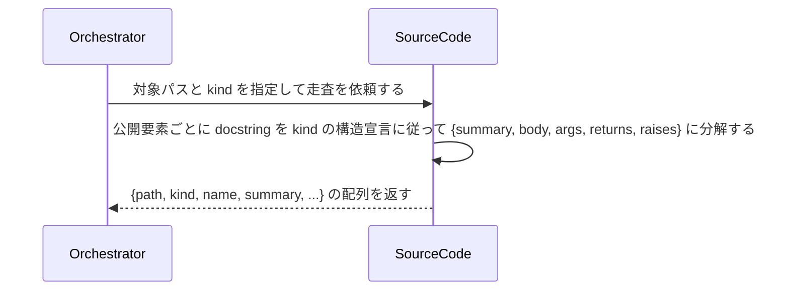

# ソースコードからdocstringを構造化抽出する：ScanSourceCode

## 概要

- AI がソースコード本体を直接読まずに、DocstringSchema の kind に従って docstring を構造化抽出したインデックスビューを取得する。

---

## 存在意義

- AIがリポジトリ全体のソースコード本体を毎回直接読むと、無関係な実装詳細までコンテキストに含めてトークンを浪費し、大規模コードベースでは走査自体が非現実的になる。docstringだけを構造化抽出したインデックスが無ければ、AIは「どこに何があるか」の当たりをつける手段を持たず、毎回全文検索的な読み込みに頼ることになる。

---

## 主アクターと意図

### 主アクター

Orchestrator（HarnessAgent）

### 意図

対象コードベースから公開要素の docstring を構造化抽出し、本体を読まずに当たりをつけられるインデックスを取得する

---

## 関与する外部

- DocstringSchema（本usecaseの戻り値の型。どの集約にも属さず、どこにも永続化されない）

---

## 事前条件

- 対象コードベース（ディレクトリ）のパスが要望テキストで与えられている
- 対象言語に対応する DocstringSchema の kind が解決できる

---

## 基本フロー



---

## 事後条件

- 公開要素ごとに、次のフィールドを持つオブジェクトの配列が返る: path（ファイルパス）・kind（DocstringSchemaのkind）・elementKind（module/class/functionのいずれか）・name（要素名）・hasDocstring（docstringが存在するか。真偽値）・signatureParams（実シグネチャの引数名の配列。function/method以外は空配列）・summary（要約行。無ければ空文字）・body（本文。無ければ空文字）・args（docstringの引数説明。{name, description}の配列。無ければ空配列）・returns（戻り値の説明。ジェネレータのYieldsも含む。無ければ空文字）・raises（{exceptionType, condition}の配列。無ければ空配列）・attributes（クラスの公開属性説明。{name, description}の配列。elementKind=class以外は空配列）
- signatureParamsはdocstringでなく実際の関数シグネチャから取得する（argsとの突合に使うため）
- private要素（言語の慣例で非公開とされるもの。例: Pythonの先頭`_`）は既定では対象外になる
- インデックスは保存されない（読み取りのたびに再計算する）
- ★現状の実装ではkind=googleのみ対応している。DocstringSchemaが宣言するtsdoc/javadoc/godoc/rustdocの4kindは、対応する言語のadapterが未実装であり、これらを指定するとUNSUPPORTED_KINDエラーになる（将来対応するadapterを追加する際の設計として維持している）

---

## 受け入れ基準

- When 対象パスと kind が与えられたとき、システムは各公開要素を {path, kind, elementKind, name, hasDocstring, signatureParams, summary, body, args, returns, raises, attributes} の構造で返す shall。
- When 要素が function/method であるとき、システムは実シグネチャの引数名を signatureParams に含める shall（docstring の記載有無によらない）。
- When 要素が module/class であるとき、システムは signatureParams を空配列で返す shall。
- When 要素が class であるとき、システムは公開属性の説明（Attributes 相当のセクション）を attributes に含める shall。class 以外は attributes を空配列で返す shall。
- When 要素に docstring が無いとき、システムは summary/body/args/returns/raises/attributes を空値（空文字・空配列）で返し、走査全体は失敗させない shall。
- While 対象言語に対応する DocstringSchema の kind が無いとき、システムは UNSUPPORTED_KIND エラーを返す shall。
- When ソースコードの本体（docstring 以外の行）を返す必要がないとき、システムは本体を読み込んだ上でも構造化データ以外を出力に含めない shall。

---

## 操作保証

- When 対象パスが存在しないとき、システムは INVALID_PATH エラーを返す shall（対象を特定し取得する解決プロセス自体の契約であり、複数のusecaseに共通する）。

---

## エラー

| コード | 条件 |
|---|---|
| `UNSUPPORTED_KIND` | - 対象言語に対応する DocstringSchema の kind が無い |
| `INVALID_SOURCE` | - 対象ファイルが構文解析できない（言語のパーサでエラー） |

---

## 受け入れシナリオ

### 公開要素の docstring を構造化抽出する

| 分類 | 観点 |
|---|---|
| 正常系 | 抽出：kind の構造宣言に従って summary/body/args/returns/raises に分解する |

```gherkin
Scenario: 公開要素の docstring を構造化抽出する
  Given 対象コードベースと google kind
  When 対象パスを走査する
  Then 各公開要素が {summary, body, args, returns, raises} を持つ構造で返る
```

### docstring が無い要素も走査全体を失敗させない

| 分類 | 観点 |
|---|---|
| 正常系 | 頑健性：一部の docstring 欠如で走査全体を失敗させない |

```gherkin
Scenario: docstring が無い要素も走査全体を失敗させない
  Given docstring を持たない公開関数を含む対象コードベース
  When 対象パスを走査する
  Then 走査は成功し、docstring が無い要素は summary 等が空の値で返る
```

### 対応する kind が無い言語は UNSUPPORTED_KIND

| 分類 | 観点 |
|---|---|
| 異常系 | エラー：未対応言語の扱い |

```gherkin
Scenario: 対応する kind が無い言語は UNSUPPORTED_KIND
  Given DocstringSchema に定義の無い言語のコードベース
  When 対象パスを走査する
  Then UNSUPPORTED_KIND エラーが返る
```

---

## 操作保証シナリオ

### 存在しないパスはINVALID_PATH

| 分類 | 観点 |
|---|---|
| 異常系 | 解決契約：対象パスが実在しないとき、パスの解決に失敗しINVALID_PATHになる |

```gherkin
Scenario: 存在しないパスはINVALID_PATH
  Given 実在しない対象パス
  When 本usecaseを実行する
  Then INVALID_PATHエラーが返る
```
