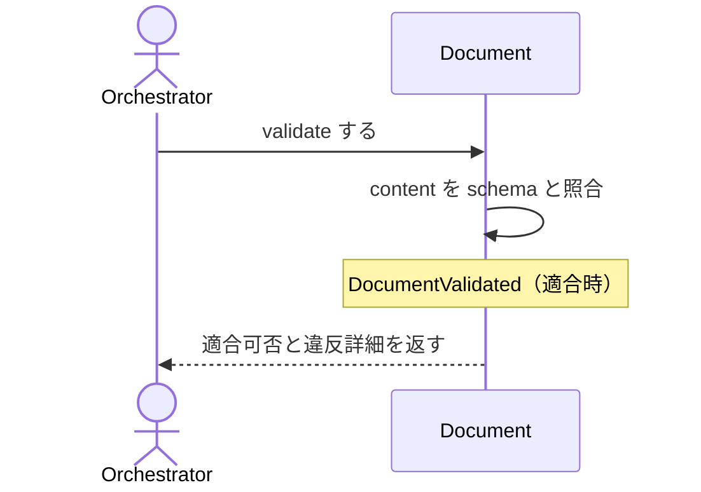

# Documentがschemaに適合するか検証する：ValidateDocument

## 概要

- Document の content が schema に適合するかを検証し、適合可否と違反詳細を返す（副作用なし）。

---

## 存在意義

- schemaへの適合が機械チェックされなければ、DocumentをCREATEDからVALIDATEDへ進めてよいかの判断が人手のレビュー頼みになり、構造的に壊れた文書がrender・reconcile等の後続処理に渡ってしまう。他の全usecase（render/query/reconcile系）はDocumentがschemaに適合していることを前提に動くため、この検証ゲートが無ければそれらの前提が保証されない。

---

## 主アクターと意図

### 主アクター

Orchestrator（HarnessAgent）

### 意図

対象 Document が schema に適合するかを判定し、進められるか確かめる

---

## 事前条件

- 対象 Document が存在する

---

## 基本フロー



---

## 事後条件

- 適合し、状態遷移も可能なとき、判定されたstatus（例: VALIDATED）が実際にdocumentへ書き込まれる
- 適合時は DocumentValidated が発行される
- schemaがこのdocument種別で"validate"を状態遷移コマンドと定義していない場合（例: SkillSchema/CodingSchemaのmaturityLifecycleにはx-lifecycle自体が無い）、statusは変更しない

---

## 受け入れ基準

- When 適合する Document が与えられたとき、システムは VALIDATED 判定を返す shall。
- When 不適合のとき、システムは違反詳細つきで失敗を返す shall。
- If schemaRef が無いとき、システムは MISSING_SCHEMA_REF を返す shall。
- When 適合し状態遷移も可能なとき、システムは判定したstatusを実際にDocumentへ書き込む shall。

---

## 操作保証

- When 対象パスが存在しないとき、システムは INVALID_PATH エラーを返す shall（対象を特定し取得する解決プロセス自体の契約であり、複数のusecaseに共通する）。
- When 対象のschemaRefを解決できないとき、システムは INVALID_SCHEMA_REF エラーを返す shall（schemaを特定し取得する解決プロセス自体の契約であり、複数のusecaseに共通する）。

---

## 受け入れシナリオ

### 適合する Document は VALIDATED 判定になる

| 分類 | 観点 |
|---|---|
| 正常系 | 適合判定：適合する Document は VALIDATED |

```gherkin
Scenario: 適合する Document は VALIDATED 判定になる
  Given schema に適合する Document
  When validate する
  Then VALIDATED 判定が返る
```

### 不適合は違反詳細つきで失敗する

| 分類 | 観点 |
|---|---|
| 異常系 | 適合判定：不適合は違反詳細つきで失敗 |

```gherkin
Scenario: 不適合は違反詳細つきで失敗する
  Given schema に適合しない Document
  When validate する
  Then 違反詳細つきで失敗する
```

### schemaRef を持たない Document は検証できない

| 分類 | 観点 |
|---|---|
| 異常系 | エラー：schemaRef 欠如は MISSING_SCHEMA_REF |

```gherkin
Scenario: schemaRef を持たない Document は検証できない
  Given schemaRef の無い Document
  When validate する
  Then MISSING_SCHEMA_REF エラーが返る
```

### 既存documentはschemaに適合する

| 分類 | 観点 |
|---|---|
| 正常系 | dogfood：waffle自身が持つ全document(skill/coding/spec)がそれぞれのschemaに適合し、正しいstatusになる(dogfood横断regression) |

```gherkin
Scenario Outline: 既存documentはschemaに適合する
  Given waffle自身のdocument
  When validateする
  Then 成功し、schemaのlifecycleに応じた正しいstatusになる
```

### SUPERSEDEDは終端でありvalidateを受け付けない

| 分類 | 観点 |
|---|---|
| 異常系 | 終端状態：SUPERSEDED状態のDocumentへのvalidateはINVALID_TRANSITIONとして拒否される |

```gherkin
Scenario: SUPERSEDEDは終端でありvalidateを受け付けない
  Given SUPERSEDED状態のDocument
  When validateする
  Then INVALID_TRANSITIONエラーが返る
```

### 不正なJSONはINVALID_JSON

| 分類 | 観点 |
|---|---|
| 異常系 | エラー：対象ファイルがJSONとして解釈できないときの失敗 |

```gherkin
Scenario: 不正なJSONはINVALID_JSON
  Given 不正なJSONの対象ファイル
  When validateする
  Then INVALID_JSONエラーが返る
```

### 適合判定は実際にstatusをdocumentへ書き込む

| 分類 | 観点 |
|---|---|
| 正常系 | 永続化：適合し状態遷移も可能なとき、判定結果を実際にdocumentへ書き込む |

```gherkin
Scenario: 適合判定は実際にstatusをdocumentへ書き込む
  Given CREATED状態の、schemaに適合するDocument
  When validateする
  Then 判定結果のstatusが実際にdocument.jsonへ書き込まれる（再読込しても反映されている）
```

---

## 操作保証シナリオ

### 存在しないパスはINVALID_PATH

| 分類 | 観点 |
|---|---|
| 異常系 | 解決契約：対象パスが実在しないとき、パスの解決に失敗しINVALID_PATHになる |

```gherkin
Scenario: 存在しないパスはINVALID_PATH
  Given 実在しない対象パス
  When 本usecaseを実行する
  Then INVALID_PATHエラーが返る
```

### 解決できないschemaRefはINVALID_SCHEMA_REF

| 分類 | 観点 |
|---|---|
| 異常系 | 解決契約：schemaRefを解決できないとき、schemaの解決に失敗しINVALID_SCHEMA_REFになる |

```gherkin
Scenario: 解決できないschemaRefはINVALID_SCHEMA_REF
  Given 解決できないschemaRef
  When 本usecaseを実行する
  Then INVALID_SCHEMA_REFエラーが返る
```
