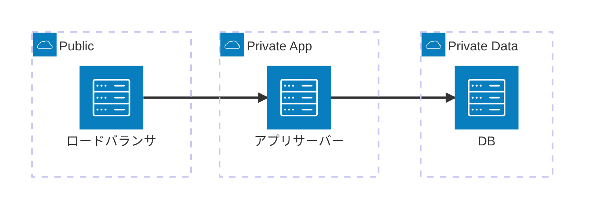

# plat-networking

---

## 概要

本プロダクトのネットワーク構成に関する要件を定める。

---

## 容量/性能要件

| 指標 | 目標値 | 根拠 |
|---|---|---|
| 帯域幅 | ピーク時1Gbps確保 | 同時アクセス目標から算出 |

---

## 耐障害性要件

| 指標 | 目標値 | 根拠 |
|---|---|---|
| マルチリージョン | 主リージョン障害時に副リージョンへ切替 | 地域規模の障害への備え |

---

## このコンポーネント固有のセキュリティ境界

| 境界 | 要件 |
|---|---|
| ゾーン間通信 | private-dataゾーンへはprivate-appゾーンからの通信のみ許可（public直接到達不可） |

---

## ネットワーク構成図

