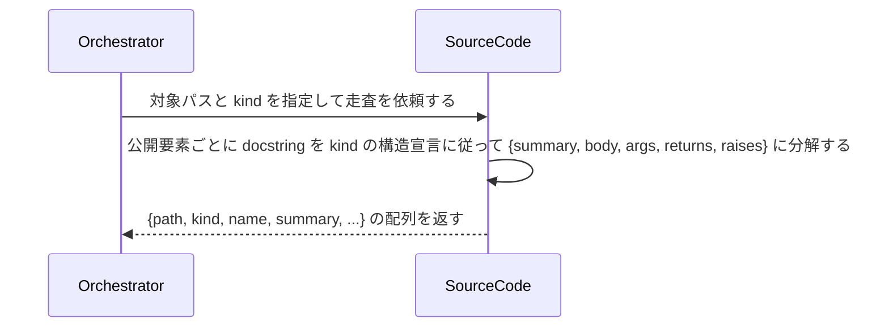

# uc-scan-source-code

---

## 概要

AI がソースコード本体を直接読まずに、DocCommentSchema の kind に従って docstring を構造化抽出したインデックスビューを取得する。

---

## 主アクターと意図

- **主アクター**: Orchestrator（HarnessAgent）
- **意図**: 対象コードベースから公開要素の docstring を構造化抽出し、本体を読まずに当たりをつけられるインデックスを取得する

---

## 関与する外部

- DocCommentSchema（kind ごとの構造宣言・レシピとして参照）

---

## 事前条件

- 対象コードベース（ディレクトリ）のパスが要望テキストで与えられている
- 対象言語に対応する DocCommentSchema の kind が解決できる

---

## 基本フロー



---

## 事後条件

- 公開要素ごとに、次のフィールドを持つオブジェクトの配列が返る: path（ファイルパス）・kind（DocCommentSchema の kind）・elementKind（module/class/function のいずれか）・name（要素名）・hasDocstring（docstring が存在するか。真偽値）・signatureParams（実シグネチャの引数名の配列。function/method 以外は空配列）・summary（要約行。無ければ空文字）・body（本文。無ければ空文字）・args（docstring の引数説明。{name, description} の配列。無ければ空配列）・returns（戻り値の説明。無ければ空文字）・raises（{exceptionType, condition} の配列。無ければ空配列）
- signatureParams は docstring でなく実際の関数シグネチャから取得する（args との突合に使うため）
- private 要素（言語の慣例で非公開とされるもの。例: Python の先頭 `_`）は既定では対象外になる
- インデックスは保存されない（読み取りのたびに再計算する）

---

## 受け入れ基準

- When 対象パスと kind が与えられたとき、エンジンは各公開要素を {path, kind, elementKind, name, hasDocstring, signatureParams, summary, body, args, returns, raises} の構造で返す shall。
- When 要素が function/method であるとき、エンジンは実シグネチャの引数名を signatureParams に含める shall（docstring の記載有無によらない）。
- When 要素が module/class であるとき、エンジンは signatureParams を空配列で返す shall。
- When 要素に docstring が無いとき、エンジンは summary/body/args/returns/raises を空値（空文字・空配列）で返し、走査全体は失敗させない shall。
- While 対象言語に対応する DocCommentSchema の kind が無いとき、エンジンは UNSUPPORTED_KIND エラーを返す shall。
- If 対象パスが存在しないとき、エンジンは INVALID_PATH エラーを返す shall。
- When ソースコードの本体（docstring 以外の行）を返す必要がないとき、エンジンは本体を読み込んだ上でも構造化データ以外を出力に含めない shall。

---

## エラー

| コード | 条件 |
|---|---|
| `INVALID_PATH` | 対象パスが存在しない |
| `UNSUPPORTED_KIND` | 対象言語に対応する DocCommentSchema の kind が無い |
| `INVALID_SOURCE` | 対象ファイルが構文解析できない（言語のパーサでエラー） |

---

## テストシナリオ

### 公開要素の docstring を構造化抽出する

| 分類 | 観点 |
|---|---|
| 正常系 | 抽出：kind の構造宣言に従って summary/body/args/returns/raises に分解する |

```gherkin
Scenario: 公開要素の docstring を構造化抽出する
  Given code_scan と対象コードベース、および google kind
  When 対象パスを走査する
  Then 各公開要素が {summary, body, args, returns, raises} を持つ構造で返る
```

### docstring が無い要素も走査全体を失敗させない

| 分類 | 観点 |
|---|---|
| 正常系 | 頑健性：一部の docstring 欠如でエンジン全体を失敗させない |

```gherkin
Scenario: docstring が無い要素も走査全体を失敗させない
  Given docstring を持たない公開関数を含む対象コードベース
  When 対象パスを走査する
  Then 走査は成功し、docstring が無い要素は summary 等が空の値で返る
```

### 対応する kind が無い言語は UNSUPPORTED_KIND

| 分類 | 観点 |
|---|---|
| 異常系 | エラー：未対応言語の扱い |

```gherkin
Scenario: 対応する kind が無い言語は UNSUPPORTED_KIND
  Given DocCommentSchema に定義の無い言語のコードベース
  When 対象パスを走査する
  Then UNSUPPORTED_KIND エラーが返る
```

### 存在しないパスは INVALID_PATH

| 分類 | 観点 |
|---|---|
| 異常系 | エラー：対象パス不在 |

```gherkin
Scenario: 存在しないパスは INVALID_PATH
  When 存在しないパスを走査する
  Then INVALID_PATH エラーが返る
```
