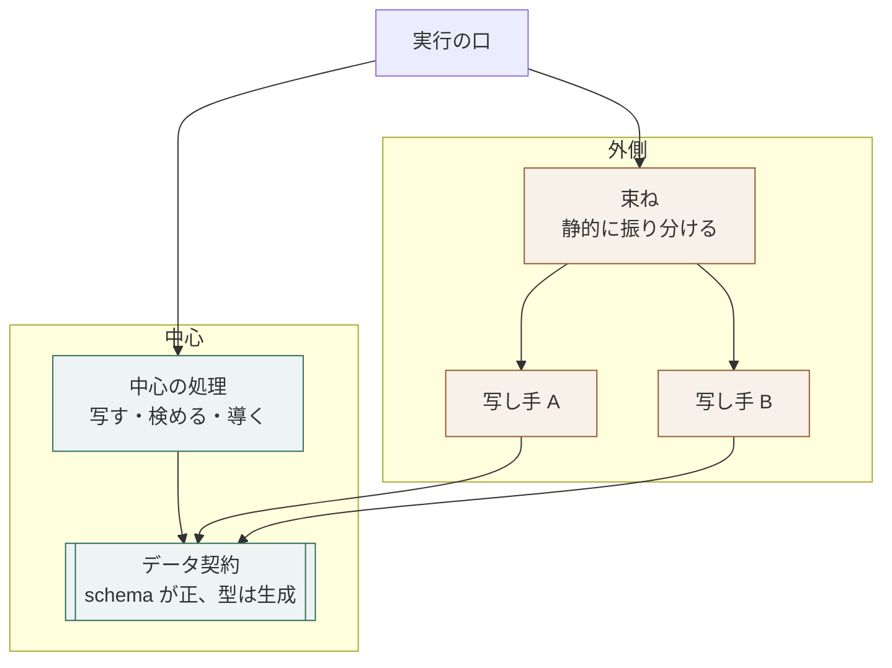

# データ契約を中心に置く構成の層

## 概要

**中心に置くのはデータの形であり、呼び出しの約束（trait）ではない。**
外側は、外部の形式を中心のデータへ写す関数として書く。

## 構成要素

| 要素 | 責務 | 知ってよいもの | 知ってはならないもの |
|---|---|---|---|
| データ契約 | 共通の形を定める。形の正は schema が持ち、型はそこから生成する | 言語の標準機能 | 他のすべての要素、外部技術、接続先 |
| 中心の処理 | データ契約の上で、写す・検める・導く・畳むを行う | データ契約 | 外側の要素、外部技術 |
| 写し手 | 接続先ごとの生の入力を、データ契約の形へ写す | データ契約、その接続先の技術 | 中心の処理、他の写し手 |
| 束ね | 写し手を1か所に集め、静的に振り分ける | データ契約、写し手 | 中心の処理の内部 |
| 実行の口 | 命令列を受け、中心の処理と束ねを呼ぶ | すべて | ─ |

## 依存の許可

| 参照元 ＼ 参照先 | データ契約 | 中心の処理 | 写し手 | 束ね | 実行の口 |
|---|---|---|---|---|---|
| データ契約 | ─ | 不可 | 不可 | 不可 | 不可 |
| 中心の処理 | 可 | ─ | 不可 | 不可 | 不可 |
| 写し手 | 可 | 不可 | ─ | 不可 | 不可 |
| 束ね | 可 | 不可 | 可 | ─ | 不可 |
| 実行の口 | 可 | 可 | 不可 | 可 | ─ |

## 依存関係図



**矢印はすべてデータ契約へ向かう。**
写し手どうしは互いを知らず、中心の処理も写し手を知らない。
**接続先を足しても、データ契約と中心の処理は変わらない。**

## 境界を越えるデータ

| 境界 | 渡す形 | 変換する場所 |
|---|---|---|
| 外部 → 写し手 | 接続先の生の形式 | 写し手 |
| 写し手 → 中心の処理 | データ契約の型 | 写し手 |
| 中心の処理 → 実行の口 | データ契約の型 | 変換しない |

## ディレクトリ構成

```
crates/
  contract/     データ契約。schema と、そこから生成した型。依存を持たない
  core/         中心の処理。contract にだけ依存する
  bundle/       写し手を束ねる。contract と写し手に依存する
  cli/          実行の口
adapters/
  <接続先>/     写し手。contract にだけ依存する
```

## 違反したとき

| 違反 | 現れ方 | 直し方 |
|---|---|---|
| 写し手が中心の処理を呼ぶ | 依存の検査で落ちる | 写す責務だけを残し、判断を中心へ移す |
| 中心の処理が接続先を分岐する | 接続先を足すたびに中心が変わる | 分岐を写し手へ移し、中心はデータ契約だけを見る |
| データ契約が外部の型を持つ | 依存の検査で落ちる | 型を生成し直し、外部の型を写し手で変換する |

## 適用範囲外

| 何を | どの層が決めるか |
|---|---|
| 要素を言語のどの仕組みで表すか | 言語 × アーキテクチャ |
| どの接続先を持つか | 用途 |
| 生成の道具 | 言語 |

## 委譲する判断

| 委譲する判断 | 委譲先 | 委譲する理由 |
|---|---|---|
| 束ねを静的に振り分けるか、実行時に選ぶか | 言語 × アーキテクチャ | 言語の仕組みで変わる |
| データ契約に必須の欄を置くか | 用途 | 接続先ごとに埋まらない欄が出る |

## 出典

| 種類 | 原典 | 版・取得日 | 照合する文字列 |
|---|---|---|---|
| 文献 | Gary Bernhardt "Boundaries"（中心を純粋に保つ考え方） | 《版・取得日》 | `functional core, imperative shell` |
| 文献 | sans-IO の設計（入出力を外へ出す） | 《版・取得日》 | `sans-io` |
