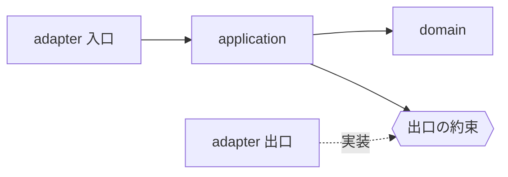

# ヘキサゴナル構成の層

## 概要

**業務の判断を中心に置き、外の世界との出入りを外周に置く。**

## 構成要素

| 要素 | 責務 | 置き場所 |
|---|---|---|
| domain | 業務の語彙と規則を持つ。外の世界を知らない | `domain/` |
| application | 業務の操作を組み立て、境界を跨ぐ入れ物を定める | `application/` |
| adapter（入口） | 外からの呼び出しを、業務の操作へ渡す | `adapter/inbound/` |
| adapter（出口） | 業務が要る外の機能を、技術で満たす | `adapter/outbound/` |

## 関係

## 許される依存

| 参照元 | 参照先 | 可否 |
|---|---|---|
| domain | いずれの層 | 不可 |
| application | domain | 可 |
| application | adapter | 不可 |
| adapter | application | 可 |

## 対象外

| 何を | どの層が決めるか |
|---|---|
| 層を何で表すか（package／module／crate） | 言語 × アーキテクチャ |
| どの層を実際に持つか | 用途 |

## 下位へ委ねる判断

| 委ねる判断 | 委ねる先 | 委ねる理由 |
|---|---|---|
| 出口の約束をどこに置くか | 言語 × アーキテクチャ | 置ける場所は言語の仕組みで変わる |

## 出典

| 種類 | 原典 | 照合する文字列 |
|---|---|---|
| 原典 | Alistair Cockburn「Hexagonal Architecture」（落とした日：《YYYY-MM-DD》） | `ports and adapters` |
